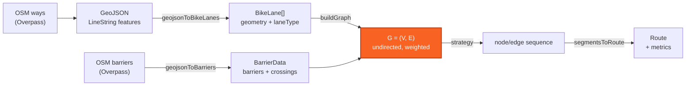
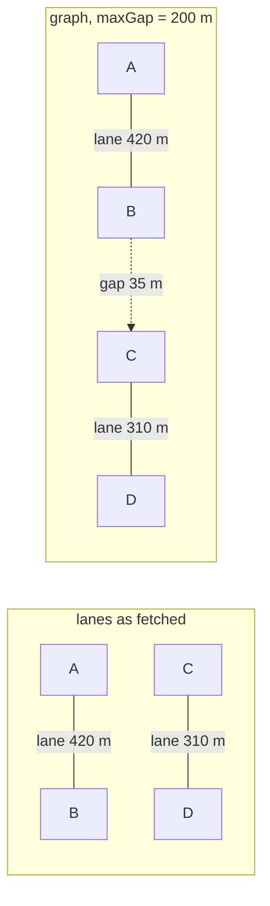
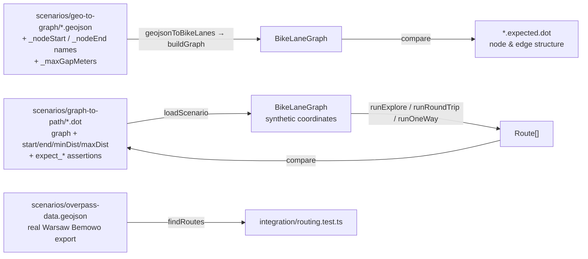

# Algorithms

The mathematics behind CycleRoute: how a bag of OSM polylines becomes a routable graph, and how
routes are extracted from it. Everything described here lives in `app/domain/` and is pure —
no browser, no network, no framework.

Companion documents: [Architecture](architecture.md) · [Features & use cases](features.md) ·
[Development guidelines](development.md) · [Backlog](../backlog/README.md)

---

## 0. Pipeline



Three coordinate conventions are in play, and mixing them up is the source of several of the
issues listed in §8:

| Space | Unit | Used by |
|---|---|---|
| Geographic | degrees `[lon, lat]` | GeoJSON, node attributes, `nearestNode` |
| Metric | meters | edge weights, gap tolerance, distance bounds |
| Key | snapped-degree string | node identity (`coordKey`) |

---

## 1. Node identity: coordinate snapping

Two lanes that meet at a junction are separate OSM ways with separate endpoint coordinates.
Their coordinates agree to within floating-point noise, but not exactly. To make them the *same*
graph node, endpoints are snapped to a grid:

```
coordKey(λ, φ) = "λ.toFixed(5),φ.toFixed(5)"
```

`toFixed(5)` rounds to 10⁻⁵ degrees. In meters, with `R = 6 371 000 m`:

$$
\Delta_{\text{lat}} = 10^{-5} \cdot \frac{\pi R}{180} \approx 1.11\ \text{m}
\qquad
\Delta_{\text{lon}}(\varphi) = 1.11 \cdot \cos\varphi\ \text{m}
$$

So the grid cell is about **1.11 m tall** and, at 52° N (Warsaw, Amsterdam, Berlin),
**0.69 m wide**. That is the right order of magnitude for OSM junction precision.

> **Caveat.** This is a *rounding* grid, not a clustering algorithm. Two endpoints 0.2 m apart
> that straddle a cell boundary receive different keys and stay disconnected. Snapping
> guarantees that identical coordinates merge; it does not guarantee that *nearby* coordinates
> merge. In practice the gap-bridging pass (§3) papers over this, because such pairs are well
> within any non-zero `maxGapMeters`.

A second consequence matters for geometry orientation — see [`10-segment-orientation-snapping`](../backlog/10-segment-orientation-snapping.md).

---

## 2. Distance functions

Three different distance calculations are used, each chosen for a different cost/accuracy
trade-off.

### 2.1 Lane length — geodesic, via Turf

Edge weights for real lanes come from `turf.length(feature, { units: 'meters' })`, which sums
the haversine distance over every consecutive vertex pair of the polyline:

$$
d = 2R \sum_{i} \arcsin\sqrt{\sin^2\!\frac{\Delta\varphi_i}{2} + \cos\varphi_i \cos\varphi_{i+1} \sin^2\!\frac{\Delta\lambda_i}{2}}
$$

This is the *travelled* length along the lane, not the straight-line distance between its
endpoints — which is exactly what a cyclist experiences. It is also the most expensive of the
three, so it is called once per lane and never in an inner loop.

### 2.2 Gap distance — equirectangular approximation

Gap detection tests every node pair the spatial index brings together (§3.4), so it needs a
cheap metric. `approxMeters` projects the pair onto a local tangent plane:

$$
d \approx R\sqrt{(\Delta\varphi)^2 + \left(\Delta\lambda \cdot \cos\varphi_m\right)^2},
\qquad \varphi_m = \frac{\varphi_1 + \varphi_2}{2}
$$

with all angles in radians and `R = 6 371 000 m`. No trigonometric inverse, one `cos` and one
`sqrt`. Its relative error grows with the square of the separation; below 10 km it stays under
0.1 %, and gap distances are two to three orders of magnitude smaller than that. For this use
the approximation is effectively exact.

### 2.3 Nearest node — the same approximation

`nearestNode` and `nodesWithinMeters` both query the node index (§3.4) and both rank by
`approxMeters`, so they cannot disagree about which node is nearest. Until
[`16`](../backlog/done/16-spatial-index.md) `nearestNode` compared squared degree deltas with no
`cos φ` correction, which over-weighted east–west displacement by `1/cos φ` — 1.62× at 52° N —
and on the Warsaw fixture picked a different node for 46 of 200 probe points near lane
endpoints. [`13`](../backlog/13-nearest-node-metric.md) keeps what is left of that task: a
return value that says how far the snap was.

---

## 3. Graph construction

`buildGraph(lanes, maxGapMeters)` produces an **undirected, simple, weighted** graph
`G = (V, E)` — `graphology` with `{ type: 'undirected', multi: false }`.

### 3.1 Vertices

Let `J` be the set of **junction keys**: snapped coordinates at which two or more distinct lanes
have a vertex, anywhere along the polyline, not only at its ends.

$$
V = \bigl\{\, \text{coordKey}(p_0^{(\ell)}),\ \text{coordKey}(p_{n-1}^{(\ell)}) \ :\ \ell \in L \,\bigr\}
\ \cup\ J
$$

The first and last vertex of every lane become nodes, and so does every interior vertex that
another lane also passes through or ends at. A lane ending at the midpoint of another lane is
joined to it there (a T-junction), and two lanes sharing a vertex where they cross are joined at
the crossing. Interior vertices that no other lane touches stay inside the edge geometry.

Two lanes that cross **without** a shared vertex still produce no node: detecting that needs a
geometric intersection test and the `layer` / `bridge` / `tunnel` tags to tell a crossing from an
overpass, and is left to a follow-up of [`09`](../backlog/done/09-mid-lane-junctions.md).

Each node stores `{ lon, lat }` — the *raw*, unsnapped coordinate of whichever lane piece most
recently merged that node.

### 3.2 Lane edges

Each lane is cut at its junction vertices (`splitAtJunctions`) into one or more **pieces**; a lane
with no interior junction is one piece. Consecutive vertices that fall inside the same snapping
cell count as one junction, cut at the first of them, so no sub-metre piece is created and no
length is lost. Each piece `π` with endpoint keys `(u, v)` becomes the edge `(u, v)` with attributes
`{ distanceMeters: turf.length(π), isGap: false, geometry: π, laneType, surface, tags }`, the last
three copied from the parent lane. `distanceMeters` is the length of the piece's own geometry, so
the sum over all lane edges equals the sum of `turf.length` over the input lanes (37 098 m on the
Warsaw fixture, exactly).

The graph is simple, so two kinds of piece cannot become an edge as they are. Both are cut at
the interior vertex nearest their middle whose key differs from both ends (`interiorCut`), and
the halves are added by the same rule, recursively:

- **Closed loops** (`u = v`): a park circuit tagged as a single way that no other lane touches.
  The cut gives two pieces between `u` and the cut vertex; the second is parallel to the first
  and is cut again, so the loop becomes a cycle of three edges. A loop that another lane touches
  inside is split there by `splitAtJunctions` and its two pieces are parallel, which the same
  rule resolves.
- **Parallel pieces** (`(u, v)` already in `E`): a second way between the same two snapped
  nodes, such as the two directions of a route mapped separately or a scenic alternative beside a
  direct connector. The new piece is cut and becomes two edges through a new node. When it has no
  interior vertex but the existing edge does, the existing edge is taken out and cut instead, so
  the result does not depend on the order Overpass returned the ways.

A piece is dropped only when nothing can be cut: a closed piece with no interior vertex (which
is sub-metre), and the longer of two straight parallel pieces, which is a duplicate way. The
counts are stored as the graph attribute `laneStats` and read with `getLaneStats`: lanes and
their length in, pieces, lane edges and their length out, pieces cut for each reason, pieces
dropped for each reason, and the dropped length. On the Warsaw fixture nothing is cut or dropped:
310 lanes, 378 pieces, 378 edges, and `edgeMeters` equals `laneMeters`
([`21-dropped-lanes`](../backlog/done/21-dropped-lanes.md)).

#### What splitting did on the Warsaw Bemowo fixture

| | Endpoints only | Split at junctions |
|---|---|---|
| Nodes | 358 | 360 |
| Lane edges | 310 | 378 |
| Connected components, lanes only | **52** | **5** |
| Gap edges at 200 m | 441 | **6** |
| Connected components at 200 m | 5 | 3 |
| Gap candidates dropped as same-component at 200 m | 664 of 2 303 | 2 247 of 2 253 |
| `buildGraph` at 200 m, median of 50 runs | 3.5 ms | 5.1 ms |

Only two nodes are new: almost every junction vertex was already a node because some lane ended
there — the lane running *through* it was simply not cut. Cutting those lanes is what turns
52 lane components into 5. The gap pass, which used to supply the missing connectivity with
441 straight lines, now finds that 2 247 of its 2 253 candidates join nodes lanes already
connect, and keeps 6.

### 3.3 Gap edges

When `maxGapMeters > 0`, every unordered pair of distinct nodes within `g` of each other that
no lane edge already joins becomes a **candidate**. The pairs come from the spatial index
(§3.4); the acceptance test is the distance itself:

$$
(u,v) \in C_{\text{gap}} \iff \text{approxMeters}(u,v) \le g
$$

Candidates are then pruned (§3.3.2), and each survivor becomes an edge with attributes
`{ distanceMeters: approxMeters(u,v), isGap: true, geometry: straight line u→v }`.

This is what stitches a fragmented lane network into something routable: the 30 m of car road
between the end of one segregated path and the start of the next becomes a first-class edge that
the router can traverse and that the metrics can count.



### 3.3.1 Why the candidate set has to be pruned

The diagram above shows the intent. Taking *every* candidate produces something else. Measured on
the Warsaw Bemowo fixture (310 lanes, 358 nodes) at the default `maxGapMeters = 200`, the
unpruned rule gives:

| | |
|---|---|
| Lane edges | 310 |
| Gap edges | **2 303** — 88 % of the graph |
| Mean node degree — lane / gap | 1.7 / **12.9** |
| Traversable distance — lane / gap | 37.1 km / **181.4 km** |
| Gap edges joining already-connected nodes | 664 (28.8 %) |

Because the rule wires together every pair of endpoints within the tolerance, and because nodes
existed only at lane endpoints when this was measured (lanes are split at junctions since
[`09`](../backlog/done/09-mid-lane-junctions.md), §3.1), each junction where several lanes
terminate becomes a small clique of gap edges. The result is less "lane network plus a few bridges" than "a dense
straight-line mesh with lanes embedded in it".

Almost none of it affects reachability. The same fixture reaches **5 connected components**
whether it is given all 2 303 gap edges or a minimum spanning forest of just **47** — and those
47 have a median length of **7 m**, which is the scale of the snapping caveat in §1 rather than
the scale of a road crossing. In other words the gaps connectivity genuinely needs are mostly
graph repair, while the long gaps — the ones most likely to cross an arterial, a railway or a
river — are the ones that are least necessary.

### 3.3.2 Pruning: which candidates become edges

`selectGapEdges` in `graph.ts` sorts the candidates by length, shortest first, and applies three
rules in order.

| # | Rule | Effect |
|---|---|---|
| 1 | Drop a candidate whose endpoints lane edges already connect | Removes 664 of 2 303 (28.8 %) at provably zero cost to reachability |
| 2 | Keep a candidate while either endpoint has fewer than `MAX_GAP_EDGES_PER_NODE` gap edges | Keeps the union of the k shortest gaps per node |
| 3 | Restore any dropped candidate that still joins two separate components | Makes "connectivity is unchanged" true by construction rather than by measurement |

Rule 1 needs the components formed by lane edges alone, so a union-find pass runs over the lane
edges before the candidates are sorted. Rule 3 continues that union-find through the candidates
kept by rule 2, so it fires only when both endpoints are already saturated and nothing else
bridges the two sides. On the Warsaw fixture it never fires; it is the guarantee, not the
workhorse.

`buildGraph` records the counts as the graph attribute `gapStats`, read with `getGapStats`:
candidates considered, edges kept, dropped by rule 1, dropped by rule 2, and restored by rule 3.

**What pruning changes on the fixture.** Component counts are identical at every tolerance — the
primary assertion in `app/integration/gap-pruning.test.ts`:

| `maxGapMeters` | Gap edges before | Gap edges after | Components before / after | Median gap before / after |
|---|---|---|---|---|
| 50 | 965 | 263 | 14 / 14 | 29.6 m / 17.1 m |
| 100 | 1 583 | 321 | 12 / 12 | 43.4 m / 19.9 m |
| 200 | 2 303 | **441** | 5 / 5 | 60.5 m / 31.1 m |
| 500 | 6 173 | 545 | 1 / 1 | 254.3 m / 54.6 m |

At the default tolerance that is **80.9 % fewer gap edges**, and invented traversable distance
falls from 181.4 km to 27.0 km, against 37.1 km of real bike lane.

### 3.3.3 Choosing k

`MAX_GAP_EDGES_PER_NODE = 2`. Connectivity cannot choose k — every value gives the same component
count — so k was chosen on **route diversity**. The counts below are distinct routes from the
integration fixture's start point over 2–10 km, averaged across 10 seeded runs of the random
walks that were the router at the time (since replaced, §5), with the mean bike-lane coverage of
those routes:

| Variant | Gap edges | Explore routes | Coverage | Round-trip routes | Coverage | Seeds with ≥ 3 round-trip routes |
|---|---|---|---|---|---|---|
| Unpruned | 2 303 | 764.1 | 83.9 % | 127.1 | 70.4 % | 10 / 10 |
| k = 1 | 252 | 66.7 | 98.6 % | **2.4** | 88.6 % | **4 / 10** |
| k = 2 | 441 | 118.5 | 94.2 % | 28.5 | 87.2 % | 10 / 10 |
| k = 3 | 597 | 197.9 | 91.3 % | 47.8 | 81.3 % | 10 / 10 |
| k = 4 | 732 | 180.0 | 92.0 % | 84.7 | 80.5 % | 10 / 10 |
| k = 6 | 964 | 508.9 | 86.1 % | 116.2 | 76.3 % | 10 / 10 |
| k = 8 | 1 142 | 551.2 | 86.2 % | 122.5 | 73.8 % | 10 / 10 |

Route counts rise with k and never level off, so there is no k at which diversity stops
improving. Every increment buys more routes and pays in invented distance and lower coverage. The
requirement that does discriminate is the fallback in §6.2: below `MIN_ROUTES_BEFORE_EXPAND` = 3
routes the graph is rebuilt at a 1 000 m tolerance, which undoes the pruning.

- **k = 1 fails it.** Round-trip averages 2.4 routes and misses the threshold in 6 of 10 seeds,
  so the fallback would fire on most requests.
- **k = 2 clears it in every seed**, with 28.5 round-trip and 118.5 explore routes — more than
  "New Route" can cycle through — at the highest lane coverage of any k that clears it.
- **k ≥ 3** buys routes the UI cannot use, at roughly 27 % more gap edges per step of k and
  falling coverage.

So k = 2 is the smallest value that never triggers the fallback. Re-run the measurement on a
denser network before treating these ratios as general.

**Sub-metre gaps are not fixed here.** Of the 441 edges kept at k = 2, only 23 are shorter than
5 m — the snapping artifacts of §1. Merging those endpoints as *nodes*, by clustering rather than
`toFixed(5)` rounding, is the better fix and belongs with
[`09-mid-lane-junctions`](../backlog/09-mid-lane-junctions.md). After pruning they are 5 % of the
gap edges rather than a headline problem.

Pruning is a prerequisite for [`28-barrier-veto`](../backlog/done/28-barrier-veto.md) — 441
intersection tests per build instead of 2 303 — and for
[`01-gap-penalty-and-tolerance`](../backlog/done/01-gap-penalty-and-tolerance.md), which prices what
survives.

### 3.3.4 The barrier veto

A gap is a straight line, and until this point nothing said what it crosses. Two rules now do.

**Grade separation.** Each lane's level comes from its OSM tags — `layer` when present, otherwise
+1 for `bridge`, −1 for `tunnel`, else 0 — and each node carries the set of levels of the lanes
that end there. A candidate whose endpoints share no level is dropped outright: those lanes pass
over or under one another, whatever the map distance between their endpoints. This is a hard
drop, not a mark, because such a pair is not a connection at any tolerance.

**Barriers.** `findBlockingBarrier` tests the straight line against geometry a rider cannot cross
wherever they like:

| Kind | OSM tags |
|---|---|
| `major_road` | `highway=motorway\|trunk\|primary\|secondary` |
| `railway` | `railway=rail\|light_rail\|subway` |
| `water` | `waterway=river\|canal`, `natural=water` |

A barrier that is itself on a bridge or in a tunnel is discarded when the data is parsed: a
motorway on a viaduct blocks nothing at ground level. Everything else carrying `bridge` or
`tunnel`, plus `highway=crossing` and `railway=level_crossing` nodes, becomes a **crossing**.

An intersection is excused when a crossing lies within `CROSSING_TOLERANCE_METERS` (20 m) of the
intersection point **and** within 5 m of the barrier itself. The second condition matters: a
crossing node belongs to the way it crosses, so without it the pedestrian crossing on the side
street would excuse a gap over the arterial beside it.

Gaps that survive are **marked, not dropped**: the edge gets `barrier: <kind>` and a `costMeters`
of `distanceMeters × BARRIER_COST_MULTIPLIER`. Marking keeps a wrongly flagged gap from
fragmenting the network into "no route found", which is a worse failure than a flagged route.
The two routing paths honour the mark differently:

- Every search (§5) minimises `costMeters`, so a flagged gap loses to any detour up to 50× its
  length. Distance bounds are still checked against real length.
- Explore and round-trip (§5.1, §5.2) then drop a route that crosses a flagged gap while any
  clean route was found from the same start, so such a route is offered only as a last resort.

Geometry uses a uniform grid over barrier segments (cells of 0.002°, about 220 m) and an exact
segment-segment intersection test rather than `turf.lineIntersect`, which would allocate a
feature per pair.

#### What it flags on the fixture

Warsaw Bemowo, 310 lanes, with the barrier layer for the same box: 339 barriers (254 major roads,
66 railways, 19 water) and 1 392 crossings.

| `maxGapMeters` | Gap edges | Flagged | Flagged without the crossing rule | Components |
|---|---|---|---|---|
| 50 | 263 | 4 | 53 | 14 |
| 100 | 321 | 14 | 70 | 12 |
| 200 | 441 | **41 (9.3 %)** | 109 | 5 |
| 500 | 544 | 76 | 148 | 2 |

Crossings excuse 62 % of the intersections at the default tolerance — the difference between a
usable veto and one that would flag a quarter of every gap in a city.

All 41 flags at 200 m were re-derived from the raw GeoJSON by an independent script: every one
crosses a `secondary` road, 40 of them cross a road with **no mapped crossing anywhere on it**,
and the remaining one has its nearest crossing 36 m away. Nothing sits in the 20–30 m band, so
the flag count is not sensitive to the exact tolerance. What that check cannot establish is
whether each flagged crossing is genuinely impossible on the ground; that needs aerial imagery
and a human.

Grade separation drops one candidate at 500 m on this fixture and none below that — the Bemowo
cycleways carry almost no `layer`, `bridge` or `tunnel` tags. It costs a component (1 → 2 at
500 m), which is the correct answer rather than a regression.

Checking costs about **1.4 ms** per graph build here (4.8 ms without barriers, 6.2 ms with),
plus 2.6 ms to parse and classify the barrier layer.

#### What it still does not know

- A gap that runs **inside** a water polygon without crossing its bank is not flagged. Only
  boundary crossings are tested.
- Water bodies mapped as multipolygon **relations** are not fetched, so large lakes may be
  missing.
- A crossing is treated as usable by a bike. A footbridge with steps counts.
- Nothing checks the barrier's own crossability beyond its tags: a `secondary` road with a
  central reservation and one with a painted line weigh the same.

### 3.3.5 Pricing what survives

Pruning removed the gaps that carry nothing, and the veto flagged the ones that cross something.
What is left still has to be *priced*, or the router treats a metre of road as a metre of
cycleway. Every edge therefore carries two numbers:

| Attribute | Meaning |
|---|---|
| `distanceMeters` | The real distance. Every metric a rider sees is built from this. |
| `costMeters` | What the router minimises. |

$$
\text{costMeters} = d \cdot p(d) \cdot \beta,
\qquad
p(d) = \begin{cases}
1 & \text{lane edge} \\[2pt]
k\left(1 + \dfrac{d}{g}\right) & \text{gap edge}
\end{cases}
\qquad
\beta = \begin{cases} 50 & \text{crosses a barrier} \\ 1 & \text{otherwise}\end{cases}
$$

with `k = GAP_PENALTY_FACTOR = 5` and `g = maxGapMeters`. A gap costs five times its length as it
approaches zero and ten times at the full tolerance, so **one long gap costs more than the same
distance split into several short ones** — which is how the discomfort actually scales, and the
reason the factor grows with length rather than staying flat.

#### Choosing the factor

Measured on the Warsaw fixture from the integration start point, 2–10 km, mean of 10 seeded runs
of the random walks that were the router at the time (since replaced, §5).
`cover%` is mean bike-lane coverage across the batch, `barrier%` the share of routes containing a
flagged gap:

| Model | explore routes | cover% | loop routes | cover% | loop barrier% |
|---|---|---|---|---|---|
| No penalty (`k = 1`) | 203.1 | 76.6 | 28.5 | 79.3 | 45.3 |
| Flat ×3 | 343.5 | 84.5 | 50.4 | 83.6 | 45.8 |
| Flat ×5 | 400.6 | 86.6 | 57.1 | 84.9 | 46.9 |
| Flat ×10 | 446.2 | 89.4 | 59.8 | 87.2 | 44.6 |
| Length-scaled ×3 | 361.7 | 86.4 | 46.7 | 85.1 | 47.5 |
| **Length-scaled ×5** | **412.7** | **88.8** | **58.2** | **86.5** | **44.2** |
| Length-scaled ×10 | 435.2 | 90.8 | 60.3 | 87.8 | 45.3 |

Two readings decide it:

- **Length-scaling beats a flat factor at the same base**, on coverage and on route count
  (×5: 88.8 % against 86.6 % on explore). Charging long gaps more steers walks onto several short
  crossings instead of one long one, and short gaps are the ones most likely to be real.
- **Coverage keeps rising with `k`, so the measurement alone would push it up without limit.**
  What bounds it is what the number *claims*. At `k = 5` the router will ride up to 750 m of
  cycleway to avoid a 100 m gap at the default tolerance; at `k = 10` it would ride 1.5 km, and
  for a 200 m gap, 4 km. The first is a trade a nervous rider makes. The second is not. `k = 5`
  is the largest factor whose implied detour stays plausible.

#### What it changed against the old behaviour

Before this, the walks used a hard rule — never take a gap while any lane is available — and
Dijkstra ignored gaps entirely. Same fixture, same start:

| | explore routes | cover% | loop routes | cover% | loop barrier% |
|---|---|---|---|---|---|
| Hard rule, no pricing @ 200 m | 113.6 | 94.7 | 31.5 | 86.3 | **88.9** |
| Weighted, priced @ 200 m | 412.7 | 88.8 | 58.2 | 86.5 | 44.2 |
| Hard rule, no pricing @ 100 m | 84.3 | 98.6 | **3.5** | 98.6 | 2.9 |
| Weighted, priced @ 100 m | 281.5 | 95.1 | 34.6 | 90.7 | 15.0 |

Mean coverage **falls** by 3–6 points, and that is the honest headline. The old rule maximised
coverage per route by refusing gaps until it had no choice, and paid for it twice:

- **It produced almost nothing to choose from.** 3.5 distinct loops at a 100 m tolerance is below
  `MIN_ROUTES_BEFORE_EXPAND`, so the fallback in §6.2 fired and widened the tolerance to 1 km —
  the rider's setting was overridden precisely because the walk was too rigid to use it. Weighted
  selection gives 34.6 loops, and the fallback stays out of it.
- **It concentrated gap use on the worst gaps.** Refusing gaps until a dead end means the gap it
  finally takes is whatever is left, which is disproportionately a flagged one: 88.9 % of loops at
  200 m contained a barrier crossing, against 44.2 % now.

A rider choosing from 58 loops at 86.5 % coverage is better served than one choosing from 31 at
86.3 % where nine in ten cross an arterial.

Refusing flagged gaps outright — rather than leaving them as a last resort — was measured too:
loops fall from 58.2 to 31.3 at 200 m, coverage rises to 89.7 %, and barrier crossings go to zero.
It is a good trade on these numbers, and it waits on the on-the-ground check that
[`28`](../backlog/done/28-barrier-veto.md) left open.

### 3.4 The spatial index

Candidate pairs are found through a uniform grid over the nodes (`spatial-index.ts`), built once
per `buildGraph` and stored on the graph for `nearestNode` and `nodesWithinMeters` (§4) to reuse.
The cell is `g` metres tall and at least `g` metres wide everywhere the nodes are, so two nodes
within `g` of each other are never more than one cell apart and every cell is compared with
itself and its eight neighbours only.

```
cellLatDeg = g / M                      M = R · π / 180, the metres per degree approxMeters uses
cellLonDeg = cellLatDeg / cos φ_max     φ_max = the largest |latitude| in the node set
```

**Is the index exact?** It must never separate a pair that is genuinely within `g`.

- *Latitude.* `approxMeters ≤ g` implies `|Δφ| ≤ g / M = cellLatDeg`, so the rows differ by at
  most one. The cell is sized with the same `M` as the distance function, and widened by
  `1 + 10⁻⁶` so a pair whose distance rounds to exactly `g` still lands in adjacent cells.
- *Longitude.* `approxMeters ≤ g` implies `|Δλ| · cos φ_m ≤ g / M`, and `cos φ_m ≥ cos φ_max`
  because both nodes lie inside the set's latitude range. So `|Δλ| ≤ cellLonDeg` and the columns
  differ by at most one, at any latitude short of the pole itself.

The rectangular prefilter this replaced used a fixed `3 g / 111 000°` longitude window, which is
narrower than `g` once `cos φ < 1 / (3 · 1.00288)`, i.e. above **70.6°** — it silently dropped
valid pairs in northern Norway. Sizing the column from `φ_max` removes that limit rather than
widening it.

Cell width follows the most poleward node, so in a set spanning a wide latitude range the cells
nearer the equator are wider than `g` and hold a few more false candidates; the acceptance test
discards them and the result is unchanged. For a 50 km box the difference is under 1 %.

Radius queries (`pointsWithin`) scan the `⌈r / g⌉` rings of cells around the query, with the
longitude reach computed from `cos` at the query or at `φ_max`, whichever is smaller. The
nearest query scans square rings outward and stops once the best distance found is no more than
`(ring − 1)` cells, in metres, so no unscanned cell can hold a closer node.

### 3.5 Complexity

Let `L` = lane count, `P` = total polyline vertices, `N = |V| ≤ P`, `C` = candidate pairs.

| Phase | Cost |
|---|---|
| Junction detection (`coordKey` per vertex, one count per key) | `O(P)` |
| Lane ingestion + `turf.length` | `O(P)` |
| Node index | `O(N)` |
| Candidate detection | `O(N · k)` distance calls, `k` = nodes in the nine cells around a node |
| Lane components (union-find) | `O(N α(N))` |
| Candidate selection | `O(C log C)` |
| Barrier index | `O(B)` for `B` barrier segments |
| Barrier tests | `O(K · b)` for `K` kept gaps and `b` segments per grid cell |
| Total | **`O(N · k + C log C)`** — linear in `N` at fixed density |

`k` is set by the node density and the tolerance, not by the size of the fetch: at 200 m over a
city the nine cells hold a few dozen nodes. `C` grows with `g²` and is what the 1 000 m fallback
pass pays for.

Measured by `npm run bench` (`app/integration/graph-build.bench.ts`), median of five builds:

| Set | `g` | Nodes | Pair loop | Index |
|---|---|---|---|---|
| Warsaw fixture | 200 m | 360 | 6 ms | 5 ms |
| Warsaw fixture | 1 000 m | 360 | 8 ms | 7 ms |
| Synthetic city, 20 × 20 km | 200 m | 10 000 | 1 736 ms | **71 ms** |
| Synthetic city, 20 × 20 km | 1 000 m | 10 000 | 2 090 ms | **346 ms** |

Doubling the node count from 1 000 to 8 000 (three doublings) multiplied the pair loop's time by
60 and the index's by 13.5; `graph-build.test.ts` asserts the ratio stays under 32. At 1 000 m
the remaining cost is the 380 000 candidates the synthetic set produces — every lane there is
isolated, so nothing is dropped as same-component before the sort — and not the search. What is
left of the stall is [`17-web-worker`](../backlog/17-web-worker.md).

---

## 4. Start candidate selection

Routes do not begin at a single snapped node. `nodesWithinMeters(G, λ, φ, r)` returns

$$
S = \{\, u \in V : \text{approxMeters}(u, (\lambda,\varphi)) \le r \,\}
$$

through the node index (§3.4), with `r = startProximityMeters` (default 200 m), in node order.
When `S = ∅` it falls back to `{ nearestNode(G, λ, φ) }`, so `S` is non-empty for any non-empty
graph.

The routing strategy is then run independently from **every** `u ∈ S`. Standing at a junction of
four bike paths therefore produces four families of routes rather than one — the single biggest
lever on route diversity in the current design.

---

## 5. Routing strategies

Three strategies implement one interface:

```ts
interface RoutingStrategy {
  findRoutes(graph: BikeLaneGraph, startKey: string): Route[]
}
```

`buildStrategy` selects among them: `endKey` present → one-way; else `roundTrip` → round-trip;
else explore. All three are built on two searches in `search.ts`, and none of them draws a random
number while it runs: the only randomness left is a seed that rotates the round-trip bearing fan
(§5.2), so `findRoutes(lanes, preferences, { seed })` always returns the same batch for the same
inputs.

### 5.0 The two searches

**A\*** (`astar`) finds the cheapest path from one node to another over `costMeters`, popping
nodes from a binary heap in order of `g(n) + h(n)`. With `h = 0` it is Dijkstra; the app passes
`haversineTo(goal)`:

$$
h(n) = \text{haversine}(n, \text{goal})
$$

It is admissible because every edge costs at least its length (`costMeters = d · p · β` with
`p, β ≥ 1`, §3.3.5) and every length is at least the straight line between its ends. It is the
*lane* multiplier of 1 that makes this safe. Scaling `h` by the gap penalty would guide the search
harder, but a node's remaining path might be all lane, and an overestimate there can skip the
cheapest route — so the heuristic stays at the minimum edge multiplier and gives up some guiding
power. Haversine rather than `approxMeters` (§2.2) because the approximation can overshoot the
great-circle distance by a fraction of a percent, which is enough to break a tie the wrong way.

The heuristic is consistent (triangle inequality), so a node is final the first time it is popped
and is never reopened. `astar` also reports how many nodes it settled; `grid-heuristic.dot` uses
that to pin the gain: across a 7 × 7 grid of 100 m lanes, the guided search settles 6 nodes to
Dijkstra's 33 for the same path.

An optional `edgeCostFactor` multiplies chosen edges' cost for one search. The round-trip return
leg uses it (§5.2).

**The bounded shortest-path tree** (`shortestPathTree`) is Dijkstra over `costMeters` from one
node to every node reachable within `maxDist` of *real* length, returned as a parent map with each
node's cost, distance and the number of flagged gaps on its path. An edge is not relaxed when it
would carry the path past `maxDist`, so a node is reached by the cheapest path among those that
stay within the bound at every step. (A node reachable within the bound only by a dearer path
than the one that settled it can be missed; the bound is a pruning rule, not a bi-criteria
search.)

### 5.1 Explore — a destination in every direction

Explore has no goal to aim a heuristic at, so it runs the tree once and chooses where to go from
what the tree found:

```
tree ← shortestPathTree(start, maxDist)
candidates ← { n ∈ tree : n ≠ start, dist(n) ≥ minDist }
if any candidate has no flagged gap on its path: drop those that do     // last resort rule
sort candidates by bearing from start
split into MAX_EXPLORE_ROUTES sectors of equal count
for each sector: pick the candidate whose dist is nearest (minDist + maxDist) / 2
drop any pick that lies on the tree path of another pick
return the tree path to each remaining pick
```

Three consequences:

- **Both distance bounds hold.** `minDist` by selection, `maxDist` by construction of the tree.
  `overshoot.dot` pins the upper bound, which the random walk this replaced did not keep
  ([`11`](../backlog/done/11-explore-distance-bounds.md)).
- **Every route is the cheapest way to where it goes.** The tree minimises cost, so an explore
  route uses a gap only when no lane path reaches its destination or the lane path costs more than
  5–10× the gap's length. On the Warsaw fixture from the integration start, every route in the
  2–10 km range stays entirely on lanes.
- **The rule for flagged gaps is a filter, not a draw.** The walk used to keep barrier-crossing
  gaps out of the random choice until nothing else was left; here a destination whose path crosses
  one is dropped while a clean destination exists (`barrier-last-resort.dot`).

Sectors are quantiles of bearing, not fixed angles, so a start on the edge of the loaded area
still gets its share of routes. A sector's pick is the candidate nearest the middle of the range,
which is the reading of "10–30 km" a rider expects.

### 5.2 Round-trip — a far point and two legs

A loop of length `L` is roughly a circle of circumference `L`, whose diameter is `L / π`. So the
strategy casts a far point that far from the start, snaps it to the nearest node, rides out to it
and finds a different way back:

```
tree ← shortestPathTree(start, maxDist)          // outbound legs, shared by every bearing
D ← (minDist + maxDist) / 2 / π
offset ← seededRandom(seed)() · (360 / N_BEARINGS)
for i in 0 … N_BEARINGS − 1:
    far ← nearestNode( destinationPoint(start, D, offset + i · 360 / N_BEARINGS) )
    if far = start or far ∉ tree or far already tried: continue
    out ← tree path to far
    back ← astar(far, start, h = haversineTo(start), edges of out cost × RETRACE_COST_FACTOR)
    cut the shared tail where back retraces the end of out
    if any other edge of back is in out: continue         // no loop keeps the promise
    loop ← out + back
    if minDist ≤ length(loop) ≤ maxDist: emit loop
if any emitted loop has no flagged gap: drop those that do
```

**The return leg is edge-disjoint by construction, with one exception it repairs.** The outbound
edges are not forbidden but priced at `RETRACE_COST_FACTOR = 1 000` times their cost, so the
return uses one only where nothing else leads home. That happens when the far point snaps to a
dead end: the return has to ride back down the spur. `closeLoop` cuts that shared tail off both
legs, which moves the far point back to the last junction, and rejects the loop if any other edge
repeats. `round-trip-spurs.dot` exercises the repair (every node of a ring has a spur, and the far
point often lands on one); `round-trip-lollipop.dot` pins the rejection (the only way home
repeats the stick, so no loop is returned).

**Where it cannot help.** A start with no non-bridge edge is on no cycle at all, whatever the
search. On the Warsaw fixture at 200 m that is 14 of a 36-node sample; the strategy closes a
2–10 km loop from 55.6 % of the sample against that ceiling of 61.1 % (the rest lie on cycles
outside the band), and from 13 of the 14 start candidates near the integration start — the
fourteenth is on no cycle. At the 1 000 m fallback tolerance it reaches the ceiling exactly,
80.6 %. The random walk managed 21.3 % of the sample and 18.6 % near the start at 200 m.

**Choosing `N_BEARINGS`.** Measured on the fixture, 2–10 km, 36 sampled starts × 5 seeds:

| Bearings | Starts with a loop | Loops per start | ms per start |
|---|---|---|---|
| 4 | 43.9 % | 0.93 | 0.61 |
| 8 | 53.3 % | 1.65 | 0.94 |
| **12** | **55.6 %** | **2.14** | **1.34** |
| 16 | 55.6 % | 2.41 | 1.59 |
| 24 | 55.6 % | 2.77 | 1.91 |

Success saturates at 12; beyond that only near-duplicate loops are added. (Measured with an A*
per outbound leg; sharing the legs through one tree then brought 12 bearings to 0.80 ms per
start.)

**What the seed does.** It rotates the fan by up to one step, so two seeds cast at different
points and usually find different loops; with the same seed the loops are identical. It does not
otherwise enter the search.

### 5.3 One-way — A\*

Point-to-point routing is one `astar` call from each start candidate to `endKey`, with
`haversineTo(endKey)` as the heuristic. `costMeters` is the edge length for a lane, 5–10× it for
a gap and 50× that again for a gap flagged by the barrier veto (§3.3.4–3.3.5). All weights are
non-negative and the heuristic is admissible, so the path is the cheapest — over cost, not
distance. The distance filter below still uses real length, and `findRoutes` keeps only the
shortest of the per-candidate results.

The result is then **filtered**, not constrained:

```
if total < minDist or total > maxDist: return null
```

A* minimises cost, so if the cheapest path is 3 km and `minDistanceMeters` is 10 km, the answer is
"no route" — even though longer valid paths exist in abundance. A minimum-distance *constraint* is
a different problem (it is NP-hard in general) and is not attempted.

Note also that `endKey` is resolved with `nearestNode` (§2.3), so a one-way route ends at the
nearest lane endpoint to the tap, not at the tap itself.

> **Naming trap.** The scenarios `one-way-chain.dot` and `one-way-branching.dot` test
> *point-to-point* routing. They have nothing to do with OSM `oneway=yes`. The graph is
> undirected and **no directional restriction of any kind is modelled** — contraflow, one-way
> streets and one-way cycle tracks are all traversable in both directions.

### 5.4 Strategy comparison

| | Explore | Round-trip | One-way |
|---|---|---|---|
| Search | one bounded tree | one bounded tree + A* per bearing | A* |
| Determinism | deterministic | deterministic for a seed | deterministic |
| Returns to start | never | always | no |
| `minDist` | guaranteed | guaranteed | filter only |
| `maxDist` | guaranteed | guaranteed | filter only |
| Prefers lanes | by cost | by cost | by cost |
| Avoids flagged gaps | 50× cost, then filtered out while a clean route exists | same | 50× cost |
| Routes per candidate | ≤ `MAX_EXPLORE_ROUTES` | ≤ `N_BEARINGS` | 1 |
| Complexity | `O((V+E) log V)` | `O(N_BEARINGS · (V+E) log V)` | `O((V+E) log V)` |

On the Warsaw fixture from the integration start, 2–10 km, `findRoutes` wall time (median of 7,
graph build included) went from 14 ms to 8 ms for explore (96 → 126 routes), 16 ms to 20 ms for
round trips (7 → 60 routes, none needing the fallback), and 6 ms to 5 ms for one-way; at 10–30 km
explore went from 39 ms to 16 ms and round trips from 97 ms to 40 ms.

---

## 6. Aggregation, deduplication and the fallback

### 6.1 Route signature

Candidate routes from all start nodes are deduplicated by

$$
\text{sig}(r) = \text{join}\bigl(\,[\,c_0(s_1),\, c_0(s_2),\, \dots,\, c_0(s_k)\,],\ \texttt{"|"}\,\bigr)
$$

— the first coordinate of each segment, in order. Since `orientedGeometry` rewrites each segment
to point along the direction of travel, this is the route's node sequence **minus its final
node**. Two consequences:

- **False positives.** `A→B→C→D` and `A→B→C→E` both have signature `A|B|C`. One of them is
  silently dropped.
- **False negatives.** A loop and its mirror image, `A→B→C→D→A` and `A→D→C→B→A`, produce
  `A|B|C|D` and `A|D|C|B`. They are the same ride and both are kept, wasting slots in the batch
  that "New Route" cycles through.

Tracked as [`12-route-dedup-signature`](../backlog/12-route-dedup-signature.md).

### 6.2 Gap-tolerance expansion

After the first pass:

```
tooFew = endKey ? routes.length = 0 : routes.length < 3
if tooFew and maxGapMeters < 1000:
    rebuild graph with maxGapMeters = 1000
    re-run the strategy
```

This is a deliberate "always return something" fallback. A rider who set a 50 m tolerance can
still receive a route containing a 900 m stretch of road — but no longer silently. Routes from this
pass keep the original figure in `requestedGapMeters` while `appliedGapMeters` records what was
actually used, `wasGapToleranceWidened` reports the difference, and the sheet says so in words.
`findRoutes` also drops any route carrying a gap longer than the tolerance it was built for;
`buildGraph` cannot produce one, so that check is a guard rather than a filter.

### 6.3 Segment orientation

Edge geometries are stored in the direction the lane was ingested from OSM, which is unrelated
to the direction of travel. `orientedGeometry` reverses the coordinate array when the segment is
traversed backwards, comparing the geometry's first coordinate against the node's stored
`{ lon, lat }` with a tolerance of `1e-9` degrees (≈ 0.1 mm).

That tolerance is far tighter than the ~1 m snapping grid of §1. When two lanes share a snapped
node but have raw endpoints 0.4 m apart, the comparison fails for the lane that did *not* write
the node's attributes, and its geometry is reversed when it should not have been — producing a
segment drawn backwards and a wrong entry in the route signature. See
[`10-segment-orientation-snapping`](../backlog/10-segment-orientation-snapping.md).

---

## 7. Route metrics

Given the ordered segments `s₁…s_k` with lengths `dᵢ` and types `tᵢ ∈ {bike_lane, gap}`:

$$
D_{\text{total}} = \sum_{i=1}^{k} d_i
\qquad
D_{\text{lane}} = \sum_{i\,:\,t_i = \text{bike\_lane}} d_i
\qquad
D_{\text{gap}} = \sum_{i\,:\,t_i = \text{gap}} d_i
$$

$$
\text{coverage} = \begin{cases} D_{\text{lane}} / D_{\text{total}} & D_{\text{total}} > 0 \\ 0 & \text{otherwise}\end{cases}
\qquad
\text{gapCount} = \bigl|\{\, i : t_i = \text{gap} \,\}\bigr|
$$

$$
\text{barrierCrossingCount} = \bigl|\{\, i : s_i \text{ carries } \texttt{crossesBarrier} \,\}\bigr|
$$

A route also carries three facts about how it was built:

| Field | Meaning |
|---|---|
| `barriersChecked` | False when no barrier data was available, so nothing on the route was tested. A route restored from before barrier checking existed reads as unchecked, which is the honest default. |
| `requestedGapMeters` | The tolerance the rider asked for. |
| `appliedGapMeters` | The tolerance the route was actually built with. Larger than the requested one only after the fallback in §6.2. |

`wasGapToleranceWidened` compares the last two, `gapDistanceMeters` stores
$D_{\text{gap}}$, and `longestGapMeters` gives the longest gap on the route — the number the
guarantee in §6.2 is checked against.

`coverage` is a **distance ratio**, not a segment ratio — the headline "87 % bike lane" figure in
the UI. `gapCount` counts gap *edges*, so two consecutive gap edges through an intersection read
as two gaps even though the cyclist experiences one interruption. The UI shows that count beside
the total and longest gap distances so riders can judge both frequency and scale.

---

## 8. What the mathematics does not model

An honest list of the modelling assumptions, in rough order of how much they distort a real ride.

| # | Assumption | Consequence | Task |
|---|---|---|---|
| 1 | Junctions exist only where lanes **share a vertex** | Lanes that meet at a shared OSM node are joined there (§3.1). Two lanes that cross without a shared node — including a cycleway passing under a road — are still not connected, and telling those apart needs the `layer` / `bridge` / `tunnel` tags. | follow-up of [09](../backlog/done/09-mid-lane-junctions.md) |
| 2 | Gap edges are still invented between nodes, at most k per node | With lanes split at junctions the fixture needs 6 gap edges at 200 m instead of 441 (§3.2); those 6 are straight lines through unverified terrain. | [28](../backlog/done/28-barrier-veto.md) |
| 3 | Gap edges are **straight lines**, now tested against barriers | A gap that crosses a major road, railway or waterway away from a crossing is flagged and made expensive (§3.3.4), and lanes on different levels are never bridged. What survives is still a straight line: its distance is the crow-flies distance, not the ride. | [01](../backlog/done/01-gap-penalty-and-tolerance.md) |
| 4 | A gap costs 5–10× its length, the same premium on every kind of road | The premise is now in the cost function (§3.3.5), but one number covers a quiet residential street and a four-lane arterial alike. Level of Traffic Stress is the established model, and its own task. | — |
| 5 | The graph is undirected | `oneway=yes`, contraflow lanes and one-way cycle tracks are ignored. | — |
| 6 | A loop is a circle; an explore route ends at the middle of the range | The far point sits at `L/π` from the start on a straight bearing, so a loop through a long thin network is missed when no node is near that point, and a start on no cycle gets no loop at all (§5.2). Explore picks the destination nearest `(min + max) / 2` in each sector, never the prettiest. | [02](../backlog/done/02-astar-routing.md) |
| 7 | `laneType` and `surface` are parsed but unused | A `shared_lane` on a four-lane road weighs exactly the same as a segregated `cycleway`; cobbles weigh the same as asphalt. | [05](../backlog/05-route-preferences-ui.md) |
| 8 | No elevation model | Distance is the only cost. A 12 % climb is free. | — |
| 9 | Routes start and end at graph nodes | The start point snaps to a lane endpoint or junction, potentially hundreds of meters away; you cannot begin mid-lane. Splitting long lanes at a fixed interval would make this finer. | [29](../backlog/29-start-point-selection.md) |
| 10 | A lane between two junctions is a single edge | A long lane with no junction on it cannot be entered or left partway. | — |

---

## 9. Test scenarios

Routing is verified with a declarative fixture format rather than hand-built graphs, so scenarios
are readable as pictures and reviewable as diffs.



Three layers, deliberately separated:

- **`geo-to-graph`** — does geometry become the right graph? A `.geojson` file annotated with
  `_nodeStart`/`_nodeEnd` names is converted, then compared against an `.expected.dot` listing
  the nodes and edges (with `type=gap` marking synthetic edges). Covers endpoint merging, gap
  bridging, three-way junctions, a T-junction at an interior vertex, closed triangles, a single
  closed way, two ways between the same endpoints, and clustered endpoints that must **not** be
  bridged.
- **`graph-to-path`** — given a graph, does the router find the right paths? A `.dot` file carries
  both the graph and its assertions as graph attributes (`start`, `end`, `minDist`, `maxDist`,
  `roundTrip`, `expect_route`, `expect_any_route`, `expect_isRoundTrip`, `expect_minRoutes`,
  `expect_hasGap`, `expect_minCoverage`, …). An edge may carry `barrier=<kind>` to stand in for a
  flagged gap. A node may carry `x`/`y` positions in metres, from which an edge's length defaults;
  nodes without one are placed along a line short enough to keep the A* heuristic admissible.
  Either way route node sequences can be reconstructed and compared by name. Covers chains,
  forks, dead ends, isolated components, gap traversal and distance aggregation, loops, the
  distance ceiling, point-to-point, a loop through a ring of dead ends, a lollipop that has no
  loop, both ways of avoiding a flagged gap, and the node count A* saves against Dijkstra.
- **`integration`** — a real Overpass export of Warsaw Bemowo driven through `findRoutes`,
  asserting loop closure, distance bounds, segment-type validity and non-zero lane distance.
  `gap-tolerance.test.ts` checks the promise made about `maxGapMeters` — no returned route
  carries a longer gap, and a route from the widened pass says so on its face.
  `gap-pruning.test.ts` builds the same export both ways and asserts that pruning preserves the
  connected-component count at four tolerances, adds no gap inside a lane component, and still
  yields many distinct routes. `barrier-veto.test.ts` adds `overpass-barriers.geojson` — the
  barrier layer for the same bounding box — and pins the veto rate, the share of intersections
  that crossings excuse, and that marking never disconnects the graph. `graph-build.test.ts`
  pins the graph the spatial index produces to the one the exhaustive pair loop produced — node
  and edge counts and a hash of the edge list at five tolerances — and asserts the build scales
  sub-quadratically. `spatial-index.test.ts` checks the index against brute force at 0°, 52°,
  75° and 85° latitude.

Each `.dot` file opens with an ASCII sketch of the graph it encodes, which makes the fixtures
reviewable without running them.

**Current coverage: 216 tests, all passing.** The gaps are above the domain line — no tests for
the stores, hooks, Overpass client, IndexedDB cache or GPX writer
([`22-use-case-tests`](../backlog/22-use-case-tests.md)).

---

## 10. Constants

Every tuning constant in the routing path, in one place.

| Constant | Value | Location | Meaning |
|---|---|---|---|
| `N_BEARINGS` | 12 | `route-finder.ts` | Far points cast per start candidate for a round trip; chosen by the measurement in §5.2 |
| `MAX_EXPLORE_ROUTES` | 12 | `route-finder.ts` | Bearing sectors, and so routes, per start candidate in explore |
| `RETRACE_COST_FACTOR` | 1 000 | `route-finder.ts` | What the return leg pays to reuse an outbound edge |
| `EXPANDED_GAP_METERS` | 1 000 | `route-finder.ts` | Gap tolerance used by the fallback pass |
| `MIN_ROUTES_BEFORE_EXPAND` | 3 | `route-finder.ts` | Threshold that triggers the fallback |
| `MAX_GAP_EDGES_PER_NODE` | 2 | `graph.ts` | Gap edges kept per node; chosen by the measurement in §3.3.3 |
| `GAP_PENALTY_FACTOR` | 5 | `graph.ts` | Base cost premium on a gap; chosen by the measurement in §3.3.5 |
| `BARRIER_COST_MULTIPLIER` | 50 | `graph.ts` | Further premium on a gap that crosses a barrier |
| `CROSSING_TOLERANCE_METERS` | 20 m | `barriers.ts` | How near a crossing must be to excuse an intersection |
| `CROSSING_ON_BARRIER_METERS` | 5 m | `barriers.ts` | How near that crossing must be to the barrier itself |
| barrier index cell | 0.002° | `barriers.ts` | ≈ 220 m grid over barrier segments |
| node index cell | `maxGapMeters` | `graph.ts` | Grid cell for gap detection; `INDEX_CELL_METERS_WITHOUT_GAPS` = 200 m when no gaps are built |
| `CELL_MARGIN` | 10⁻⁶ | `spatial-index.ts` | Cell widening against rounding at exactly the tolerance |
| `METERS_PER_DEGREE` | 111 195 m | `algorithms.ts` | `R · π / 180` with `R` = 6 371 000 m; shared by `approxMeters` and the index |
| snapping precision | 5 decimals | `algorithms.ts` | ≈ 1.11 m × 0.69 m cell at 52° N |
| `maxGapMeters` | 200 m | `DEFAULT_PREFERENCES` | User-facing gap tolerance; slider range 0–500 m |
| `startProximityMeters` | 200 m | `DEFAULT_PREFERENCES` | Start candidate radius |
| `minDistanceMeters` | 10 000 m | `DEFAULT_PREFERENCES` | Target range floor |
| `maxDistanceMeters` | 30 000 m | `DEFAULT_PREFERENCES` | Target range ceiling |
| `MAX_AREA_KM` | 50 | `useBikeLanes.ts` | Largest fetchable bbox edge |
| `AREA_CACHE_STALE_AFTER_MS` | 7 days | `area-cache.ts` | Cache expiry |
