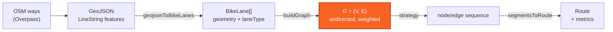
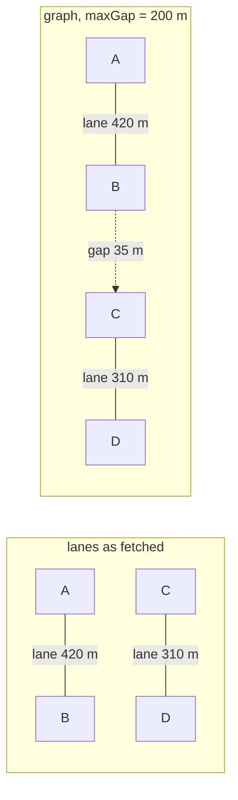
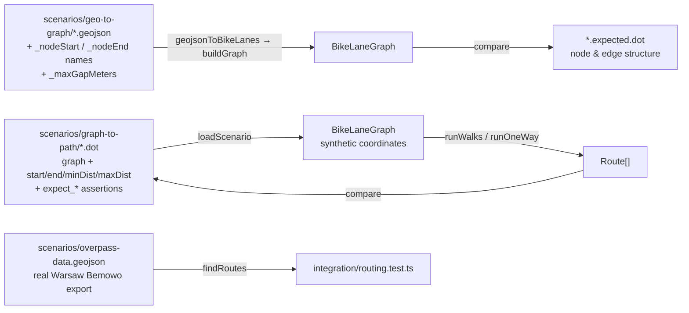

# Algorithms

The mathematics behind CycleRoute: how a bag of OSM polylines becomes a routable graph, and how
routes are extracted from it. Everything described here lives in `app/domain/` and is pure —
no browser, no network, no framework.

Companion documents: [Architecture](architecture.md) · [Features & use cases](features.md) ·
[Development guidelines](development.md) · [Backlog](../backlog/README.md)

---

## 0. Pipeline



Three coordinate conventions are in play, and mixing them up is the source of several of the
issues listed in §8:

| Space | Unit | Used by |
|---|---|---|
| Geographic | degrees `[lon, lat]` | GeoJSON, node attributes, `nearestNode` |
| Metric | meters | edge weights, gap tolerance, distance bounds |
| Key | snapped-degree string | node identity (`coordKey`) |

---

## 1. Node identity: coordinate snapping

Two lanes that meet at a junction are separate OSM ways with separate endpoint coordinates.
Their coordinates agree to within floating-point noise, but not exactly. To make them the *same*
graph node, endpoints are snapped to a grid:

```
coordKey(λ, φ) = "λ.toFixed(5),φ.toFixed(5)"
```

`toFixed(5)` rounds to 10⁻⁵ degrees. In meters, with `R = 6 371 000 m`:

$$
\Delta_{\text{lat}} = 10^{-5} \cdot \frac{\pi R}{180} \approx 1.11\ \text{m}
\qquad
\Delta_{\text{lon}}(\varphi) = 1.11 \cdot \cos\varphi\ \text{m}
$$

So the grid cell is about **1.11 m tall** and, at 52° N (Warsaw, Amsterdam, Berlin),
**0.69 m wide**. That is the right order of magnitude for OSM junction precision.

> **Caveat.** This is a *rounding* grid, not a clustering algorithm. Two endpoints 0.2 m apart
> that straddle a cell boundary receive different keys and stay disconnected. Snapping
> guarantees that identical coordinates merge; it does not guarantee that *nearby* coordinates
> merge. In practice the gap-bridging pass (§3) papers over this, because such pairs are well
> within any non-zero `maxGapMeters`.

A second consequence matters for geometry orientation — see [`10-segment-orientation-snapping`](../backlog/10-segment-orientation-snapping.md).

---

## 2. Distance functions

Three different distance calculations are used, each chosen for a different cost/accuracy
trade-off.

### 2.1 Lane length — geodesic, via Turf

Edge weights for real lanes come from `turf.length(feature, { units: 'meters' })`, which sums
the haversine distance over every consecutive vertex pair of the polyline:

$$
d = 2R \sum_{i} \arcsin\sqrt{\sin^2\!\frac{\Delta\varphi_i}{2} + \cos\varphi_i \cos\varphi_{i+1} \sin^2\!\frac{\Delta\lambda_i}{2}}
$$

This is the *travelled* length along the lane, not the straight-line distance between its
endpoints — which is exactly what a cyclist experiences. It is also the most expensive of the
three, so it is called once per lane and never in an inner loop.

### 2.2 Gap distance — equirectangular approximation

Gap detection compares every pair of nodes (§3), so it needs a cheap metric. `approxMeters`
projects the pair onto a local tangent plane:

$$
d \approx R\sqrt{(\Delta\varphi)^2 + \left(\Delta\lambda \cdot \cos\varphi_m\right)^2},
\qquad \varphi_m = \frac{\varphi_1 + \varphi_2}{2}
$$

with all angles in radians and `R = 6 371 000 m`. No trigonometric inverse, one `cos` and one
`sqrt`. Its relative error grows with the square of the separation; below 10 km it stays under
0.1 %, and gap distances are two to three orders of magnitude smaller than that. For this use
the approximation is effectively exact.

### 2.3 Nearest node — squared degrees

`nearestNode` minimises

$$
(\lambda_a - \lambda)^2 + (\varphi_a - \varphi)^2
$$

in **degrees**, with no `cos φ` correction. Because one degree of longitude is `cos φ` times
shorter than one degree of latitude, this over-weights east–west displacement by a factor of
`1/cos φ` — **1.62× at 52° N**. Given two nodes at equal true distance, one due north and one
due east, the function prefers the northern one. It is therefore only approximately "nearest".
Tracked as [`13-nearest-node-metric`](../backlog/13-nearest-node-metric.md).

---

## 3. Graph construction

`buildGraph(lanes, maxGapMeters)` produces an **undirected, simple, weighted** graph
`G = (V, E)` — `graphology` with `{ type: 'undirected', multi: false }`.

### 3.1 Vertices

$$
V = \bigl\{\, \text{coordKey}(p_0^{(\ell)}),\ \text{coordKey}(p_{n-1}^{(\ell)}) \ :\ \ell \in L \,\bigr\}
$$

Only the **first and last** vertex of each lane polyline become graph nodes. Interior vertices
are carried along inside the edge geometry but are invisible to the router.

Each node stores `{ lon, lat }` — the *raw*, unsnapped coordinate of whichever lane most
recently merged that node.

### 3.2 Lane edges

For each lane `ℓ` with endpoint keys `(u, v)`:

$$
(u,v) \in E \iff u \neq v \ \wedge\ (u,v) \notin E \ \text{already}
$$

with attributes `{ distanceMeters: turf.length(ℓ), isGap: false, geometry: ℓ }`.

Two lanes are silently discarded by this rule:

- **Closed loops** (`u = v`): a park circuit tagged as a single way disappears entirely.
- **Parallel lanes**: a second, longer way between the same two snapped endpoints is dropped,
  and the first one ingested wins regardless of length.

See [`21-dropped-lanes`](../backlog/21-dropped-lanes.md).

### 3.3 Gap edges

When `maxGapMeters > 0`, every unordered pair of distinct nodes not already joined by a lane
edge is tested. A pair that passes becomes a **candidate**:

$$
(u,v) \in C_{\text{gap}} \iff \text{approxMeters}(u,v) \le g
$$

Candidates are then pruned (§3.3.2), and each survivor becomes an edge with attributes
`{ distanceMeters: approxMeters(u,v), isGap: true, geometry: straight line u→v }`.

This is what stitches a fragmented lane network into something routable: the 30 m of car road
between the end of one segregated path and the start of the next becomes a first-class edge that
the router can traverse and that the metrics can count.



### 3.3.1 Why the candidate set has to be pruned

The diagram above shows the intent. Taking *every* candidate produces something else. Measured on
the Warsaw Bemowo fixture (310 lanes, 358 nodes) at the default `maxGapMeters = 200`, the
unpruned rule gives:

| | |
|---|---|
| Lane edges | 310 |
| Gap edges | **2 303** — 88 % of the graph |
| Mean node degree — lane / gap | 1.7 / **12.9** |
| Traversable distance — lane / gap | 37.1 km / **181.4 km** |
| Gap edges joining already-connected nodes | 664 (28.8 %) |

Because the rule wires together every pair of endpoints within the tolerance, and because nodes
exist only at lane endpoints (§3.1), each junction where several lanes terminate becomes a small
clique of gap edges. The result is less "lane network plus a few bridges" than "a dense
straight-line mesh with lanes embedded in it".

Almost none of it affects reachability. The same fixture reaches **5 connected components**
whether it is given all 2 303 gap edges or a minimum spanning forest of just **47** — and those
47 have a median length of **7 m**, which is the scale of the snapping caveat in §1 rather than
the scale of a road crossing. In other words the gaps connectivity genuinely needs are mostly
graph repair, while the long gaps — the ones most likely to cross an arterial, a railway or a
river — are the ones that are least necessary.

### 3.3.2 Pruning: which candidates become edges

`selectGapEdges` in `graph.ts` sorts the candidates by length, shortest first, and applies three
rules in order.

| # | Rule | Effect |
|---|---|---|
| 1 | Drop a candidate whose endpoints lane edges already connect | Removes 664 of 2 303 (28.8 %) at provably zero cost to reachability |
| 2 | Keep a candidate while either endpoint has fewer than `MAX_GAP_EDGES_PER_NODE` gap edges | Keeps the union of the k shortest gaps per node |
| 3 | Restore any dropped candidate that still joins two separate components | Makes "connectivity is unchanged" true by construction rather than by measurement |

Rule 1 needs the components formed by lane edges alone, so a union-find pass runs over the lane
edges before the candidates are sorted. Rule 3 continues that union-find through the candidates
kept by rule 2, so it fires only when both endpoints are already saturated and nothing else
bridges the two sides. On the Warsaw fixture it never fires; it is the guarantee, not the
workhorse.

`buildGraph` records the counts as the graph attribute `gapStats`, read with `getGapStats`:
candidates considered, edges kept, dropped by rule 1, dropped by rule 2, and restored by rule 3.

**What pruning changes on the fixture.** Component counts are identical at every tolerance — the
primary assertion in `app/integration/gap-pruning.test.ts`:

| `maxGapMeters` | Gap edges before | Gap edges after | Components before / after | Median gap before / after |
|---|---|---|---|---|
| 50 | 965 | 263 | 14 / 14 | 29.6 m / 17.1 m |
| 100 | 1 583 | 321 | 12 / 12 | 43.4 m / 19.9 m |
| 200 | 2 303 | **441** | 5 / 5 | 60.5 m / 31.1 m |
| 500 | 6 173 | 545 | 1 / 1 | 254.3 m / 54.6 m |

At the default tolerance that is **80.9 % fewer gap edges**, and invented traversable distance
falls from 181.4 km to 27.0 km, against 37.1 km of real bike lane.

### 3.3.3 Choosing k

`MAX_GAP_EDGES_PER_NODE = 2`. Connectivity cannot choose k — every value gives the same component
count — so k was chosen on **route diversity**. The counts below are distinct routes from the
integration fixture's start point over 2–10 km, averaged across 10 seeded runs of the walks, with
the mean bike-lane coverage of those routes:

| Variant | Gap edges | Explore routes | Coverage | Round-trip routes | Coverage | Seeds with ≥ 3 round-trip routes |
|---|---|---|---|---|---|---|
| Unpruned | 2 303 | 764.1 | 83.9 % | 127.1 | 70.4 % | 10 / 10 |
| k = 1 | 252 | 66.7 | 98.6 % | **2.4** | 88.6 % | **4 / 10** |
| k = 2 | 441 | 118.5 | 94.2 % | 28.5 | 87.2 % | 10 / 10 |
| k = 3 | 597 | 197.9 | 91.3 % | 47.8 | 81.3 % | 10 / 10 |
| k = 4 | 732 | 180.0 | 92.0 % | 84.7 | 80.5 % | 10 / 10 |
| k = 6 | 964 | 508.9 | 86.1 % | 116.2 | 76.3 % | 10 / 10 |
| k = 8 | 1 142 | 551.2 | 86.2 % | 122.5 | 73.8 % | 10 / 10 |

Route counts rise with k and never level off, so there is no k at which diversity stops
improving. Every increment buys more routes and pays in invented distance and lower coverage. The
requirement that does discriminate is the fallback in §6.2: below `MIN_ROUTES_BEFORE_EXPAND` = 3
routes the graph is rebuilt at a 1 000 m tolerance, which undoes the pruning.

- **k = 1 fails it.** Round-trip averages 2.4 routes and misses the threshold in 6 of 10 seeds,
  so the fallback would fire on most requests.
- **k = 2 clears it in every seed**, with 28.5 round-trip and 118.5 explore routes — more than
  "New Route" can cycle through — at the highest lane coverage of any k that clears it.
- **k ≥ 3** buys routes the UI cannot use, at roughly 27 % more gap edges per step of k and
  falling coverage.

So k = 2 is the smallest value that never triggers the fallback. Re-run the measurement on a
denser network before treating these ratios as general.

**Sub-metre gaps are not fixed here.** Of the 441 edges kept at k = 2, only 23 are shorter than
5 m — the snapping artifacts of §1. Merging those endpoints as *nodes*, by clustering rather than
`toFixed(5)` rounding, is the better fix and belongs with
[`09-mid-lane-junctions`](../backlog/09-mid-lane-junctions.md). After pruning they are 5 % of the
gap edges rather than a headline problem.

Pruning is a prerequisite for [`28-barrier-veto`](../backlog/28-barrier-veto.md) — 441
intersection tests per build instead of 2 303 — and for
[`01-gap-penalty-and-tolerance`](../backlog/01-gap-penalty-and-tolerance.md), which prices what
survives.

### 3.4 The bounding-box prefilter

The pair loop is `O(|V|²)`. To keep the constant small, a rectangular prefilter rejects pairs
before the distance call:

```
maxDeg = (g / 111000) * 1.5
skip if |Δφ| > maxDeg  or  |Δλ| > 2·maxDeg
```

**Is the prefilter safe?** A prefilter must never reject a pair that is genuinely within `g`.

- *Latitude.* The threshold `1.5g/111000` degrees corresponds to `1.5 · (111320/111000) · g ≈ 1.504 g`
  meters. Always larger than `g`. Safe everywhere.
- *Longitude.* The threshold `3g/111000` degrees corresponds to `3 · 1.00288 · g · cos φ` meters.
  This is `≥ g` only while

$$
\cos\varphi \ \ge\ \frac{1}{3 \cdot 1.00288} \approx 0.3324
\quad\Longleftrightarrow\quad
|\varphi| \le 70.6°
$$

So the prefilter is conservative for every populated cycling city on Earth, and starts silently
dropping valid gap pairs above roughly **70.6° latitude** (northern Norway, Svalbard, northern
Siberia). Worth knowing; not worth fixing before someone routes a bike in Tromsø.

### 3.5 Complexity

Let `L` = lane count, `P` = total polyline vertices, `N = |V| ≤ 2L`.

| Phase | Cost |
|---|---|
| Lane ingestion + `turf.length` | `O(P)` |
| Candidate detection | `O(N²)` prefilter tests, `O(p·N²)` distance calls where `p` is the pass rate |
| Lane components (union-find) | `O(N α(N))` |
| Candidate selection | `O(C log C)` for `C` candidates |
| Total | **`O(N²)`** |

Pruning does not change the asymptotics — finding candidate pairs still dominates — but it removes
about 80 % of the edge insertion, memory and traversal cost that follows.

A dense city fetch of ~5 000 lanes gives `N ≈ 8 000` and ~32 M pair tests, executed
synchronously on the main thread. This is the app's dominant cost and the reason "Suggest Route"
can visibly stall. Addressed by [`16-spatial-index`](../backlog/16-spatial-index.md) (grid or
R-tree, expected `O(N log N)`) and [`17-web-worker`](../backlog/17-web-worker.md).

---

## 4. Start candidate selection

Routes do not begin at a single snapped node. `nodesWithinMeters(G, λ, φ, r)` returns

$$
S = \{\, u \in V : \text{approxMeters}(u, (\lambda,\varphi)) \le r \,\}
$$

using the same prefilter as §3.4, with `r = startProximityMeters` (default 200 m). When `S = ∅`
it falls back to `{ nearestNode(G, λ, φ) }`, so `S` is non-empty for any non-empty graph.

The routing strategy is then run independently from **every** `u ∈ S`. Standing at a junction of
four bike paths therefore produces four families of routes rather than one — the single biggest
lever on route diversity in the current design.

---

## 5. Routing strategies

Three strategies implement one interface:

```ts
interface RoutingStrategy {
  findRoutes(graph: BikeLaneGraph, startKey: string): Route[]
}
```

`buildStrategy` selects among them: `endKey` present → one-way; else `roundTrip` → round-trip;
else explore.

### 5.1 Explore — self-avoiding random walk

A **node-disjoint** walk (a simple path). `visited` is seeded with the start node, so an explore
route can never return to its origin.

```
current ← start;  total ← 0;  visited ← {start}
while total < maxDist:
    N ← neighbours(current) \ visited
    if N = ∅: return null
    Nlane ← { n ∈ N : ¬isGap(current, n) }
    next ← uniform_random( Nlane ≠ ∅ ? Nlane : N )
    total ← total + w(current, next)
    emit segment
    visited ← visited ∪ {next};  current ← next
    if total ≥ minDist: return segments
return null
```

The **lane-preference rule** — `Nlane` before `N` — is the only place in the entire codebase
where bike lanes are actually favoured over gaps. It is a hard lexicographic preference at each
step, not a cost: a gap edge is taken *only* when the current node has no unvisited lane
neighbour at all. It is local and greedy, and it says nothing about the total gap distance of
the finished route.

**Distance bounds.** The loop guard is evaluated *before* the edge is appended, and the function
returns the instant `total ≥ minDist`. Therefore the returned total satisfies

$$
\text{minDist} \le \text{total} < \text{minDist} + \ell_{\max}
$$

where `ℓmax` is the length of the final edge. It can exceed `maxDist` whenever
`ℓmax > maxDist − minDist`. With the defaults (10 km / 30 km) that needs a single 20 km edge and
never happens; with a narrow range it will. `maxDist` is a loop guard, not a guarantee —
[`11-explore-distance-bounds`](../backlog/11-explore-distance-bounds.md).

**Success probability.** Undefined in closed form; the walk fails whenever it paints itself into
a dead end before reaching `minDist`. Compensated by brute force: `N_ATTEMPTS = 80` walks per
start candidate.

### 5.2 Round-trip — edge-disjoint random walk

A **trail**: edges may not repeat, nodes may. Terminates when the walk arrives back at the start.

```
current ← start;  total ← 0;  usedEdges ← ∅
loop:
    if segments ≠ ∅ and current = start:
        return total ≥ minDist ? segments : null
    A ← { n ∈ neighbours(current) : edge(current,n) ∉ usedEdges }
    if A = ∅: return null
    Alane ← { n ∈ A : ¬isGap(current, n) }
    next ← uniform_random( Alane ≠ ∅ ? Alane : A )
    if total + w(current, next) > maxDist: return null
    total ← total + w;  usedEdges ← usedEdges ∪ {edge};  emit segment
    current ← next
```

Two differences from explore are worth calling out:

- **`maxDist` is a genuine hard bound here.** The candidate edge is tested *before* it is taken.
- **First return wins.** The walk is abandoned the moment it touches the start node again, even
  if the loop so far is only 800 m of a requested 10 km. It cannot pass *through* the start and
  keep going, which discards a large family of legitimate figure-of-eight and multi-lobe loops.

Closure is left entirely to chance — nothing steers the walk homeward. This is where a
distance-aware heuristic would pay off most; see
[`02-astar-routing`](../backlog/02-astar-routing.md).

### 5.3 One-way — bidirectional Dijkstra

Point-to-point routing delegates to `graphology-shortest-path`:

```ts
dijkstra.bidirectional(graph, startKey, endKey, 'distanceMeters')
```

Edge weights are lengths in meters, all non-negative, so Dijkstra's optimality holds. Bidirectional
search expands from both ends and meets in the middle: same `O((|V| + |E|) log |V|)` bound, but
typically `√` the explored node count of the unidirectional version.

The result is then **filtered**, not constrained:

```
if total < minDist or total > maxDist: return null
```

Dijkstra minimises length, so if the shortest path is 3 km and `minDistanceMeters` is 10 km, the
answer is "no route" — even though longer valid paths exist in abundance. A minimum-distance
*constraint* is a different problem (it is NP-hard in general) and is not attempted.

Note also that `endKey` is resolved with `nearestNode` (§2.3), so a one-way route ends at the
nearest lane endpoint to the tap, not at the tap itself.

> **Naming trap.** The scenarios `one-way-chain.dot` and `one-way-branching.dot` test
> *point-to-point* routing. They have nothing to do with OSM `oneway=yes`. The graph is
> undirected and **no directional restriction of any kind is modelled** — contraflow, one-way
> streets and one-way cycle tracks are all traversable in both directions.

### 5.4 Strategy comparison

| | Explore | Round-trip | One-way |
|---|---|---|---|
| Walk class | simple path (node-disjoint) | trail (edge-disjoint) | shortest path |
| Determinism | random | random | deterministic |
| Returns to start | never | always | no |
| `minDist` | guaranteed | guaranteed | filter only |
| `maxDist` | soft (§5.1) | hard | filter only |
| Prefers lanes | greedy, per step | greedy, per step | **no** — length only |
| Attempts | 80 per candidate | 80 per candidate | 1 per candidate |
| Complexity | `O(N_ATTEMPTS · path length)` | `O(N_ATTEMPTS · trail length)` | `O((V+E) log V)` |

---

## 6. Aggregation, deduplication and the fallback

### 6.1 Route signature

Candidate routes from all start nodes are deduplicated by

$$
\text{sig}(r) = \text{join}\bigl(\,[\,c_0(s_1),\, c_0(s_2),\, \dots,\, c_0(s_k)\,],\ \texttt{"|"}\,\bigr)
$$

— the first coordinate of each segment, in order. Since `orientedGeometry` rewrites each segment
to point along the direction of travel, this is the route's node sequence **minus its final
node**. Two consequences:

- **False positives.** `A→B→C→D` and `A→B→C→E` both have signature `A|B|C`. One of them is
  silently dropped.
- **False negatives.** A loop and its mirror image, `A→B→C→D→A` and `A→D→C→B→A`, produce
  `A|B|C|D` and `A|D|C|B`. They are the same ride and both are kept, wasting slots in the batch
  that "New Route" cycles through.

Tracked as [`12-route-dedup-signature`](../backlog/12-route-dedup-signature.md).

### 6.2 Gap-tolerance expansion

After the first pass:

```
tooFew = endKey ? routes.length = 0 : routes.length < 3
if tooFew and maxGapMeters < 1000:
    rebuild graph with maxGapMeters = 1000
    re-run the strategy
```

This is a deliberate "always return something" fallback, and it is also the point at which the
product premise breaks down. A user who set a 50 m gap tolerance can receive a route containing
a 900 m stretch of arterial road, with nothing in the UI to indicate that their setting was
overridden. See [`01-gap-penalty-and-tolerance`](../backlog/01-gap-penalty-and-tolerance.md).

### 6.3 Segment orientation

Edge geometries are stored in the direction the lane was ingested from OSM, which is unrelated
to the direction of travel. `orientedGeometry` reverses the coordinate array when the segment is
traversed backwards, comparing the geometry's first coordinate against the node's stored
`{ lon, lat }` with a tolerance of `1e-9` degrees (≈ 0.1 mm).

That tolerance is far tighter than the ~1 m snapping grid of §1. When two lanes share a snapped
node but have raw endpoints 0.4 m apart, the comparison fails for the lane that did *not* write
the node's attributes, and its geometry is reversed when it should not have been — producing a
segment drawn backwards and a wrong entry in the route signature. See
[`10-segment-orientation-snapping`](../backlog/10-segment-orientation-snapping.md).

---

## 7. Route metrics

Given the ordered segments `s₁…s_k` with lengths `dᵢ` and types `tᵢ ∈ {bike_lane, gap}`:

$$
D_{\text{total}} = \sum_{i=1}^{k} d_i
\qquad
D_{\text{lane}} = \sum_{i\,:\,t_i = \text{bike\_lane}} d_i
$$

$$
\text{coverage} = \begin{cases} D_{\text{lane}} / D_{\text{total}} & D_{\text{total}} > 0 \\ 0 & \text{otherwise}\end{cases}
\qquad
\text{gapCount} = \bigl|\{\, i : t_i = \text{gap} \,\}\bigr|
$$

`coverage` is a **distance ratio**, not a segment ratio — the headline "87 % bike lane" figure in
the UI. `gapCount` counts gap *edges*, so two consecutive gap edges through an intersection read
as two gaps even though the cyclist experiences one interruption. It is computed but not yet
displayed ([`25-gap-count-metric-ui`](../backlog/25-gap-count-metric-ui.md)).

---

## 8. What the mathematics does not model

An honest list of the modelling assumptions, in rough order of how much they distort a real ride.

| # | Assumption | Consequence | Task |
|---|---|---|---|
| 1 | Junctions exist only at lane **endpoints** | A lane ending at the midpoint of another is not connected to it. The network is far more fragmented than the map looks, and the gap-bridging pass hides this by inventing edges through buildings and rivers. | [09](../backlog/09-mid-lane-junctions.md) |
| 2 | Gap edges are still invented between endpoints, now at most k per node | Pruning cut them from 2 303 to 441 on the fixture (§3.3.2), but 441 straight lines through unverified terrain remain. | [28](../backlog/28-barrier-veto.md), [09](../backlog/09-mid-lane-junctions.md) |
| 3 | Gap edges are **straight lines** with no barrier check | The "gap" may cross a canal, a railway or a motorway; `layer`/`bridge`/`tunnel` are ignored, so a cycleway on an overpass can be bridged to one beneath it. Distance and rideability are both fictional. | [28](../backlog/28-barrier-veto.md) |
| 4 | Gap edges cost their length and nothing more | Dijkstra will trade 210 m of protected path for 200 m of arterial road. The premise is not encoded in the cost function anywhere. | [01](../backlog/01-gap-penalty-and-tolerance.md) |
| 5 | The graph is undirected | `oneway=yes`, contraflow lanes and one-way cycle tracks are ignored. | [09](../backlog/09-mid-lane-junctions.md) |
| 6 | No heuristic guides the search | Round-trip closure and explore direction are pure chance; 80 attempts stand in for a distance-aware objective. | [02](../backlog/02-astar-routing.md) |
| 7 | `laneType` and `surface` are parsed but unused | A `shared_lane` on a four-lane road weighs exactly the same as a segregated `cycleway`; cobbles weigh the same as asphalt. | [05](../backlog/05-route-preferences-ui.md) |
| 8 | No elevation model | Distance is the only cost. A 12 % climb is free. | — |
| 9 | Routes start and end at graph nodes | The start point snaps to a lane endpoint, potentially hundreds of meters away; you cannot begin mid-lane. | [09](../backlog/09-mid-lane-junctions.md) |
| 10 | Every lane is a single edge | A 3 km lane cannot be entered or left partway, and cannot be partially traversed. | [09](../backlog/09-mid-lane-junctions.md) |

---

## 9. Test scenarios

Routing is verified with a declarative fixture format rather than hand-built graphs, so scenarios
are readable as pictures and reviewable as diffs.



Three layers, deliberately separated:

- **`geo-to-graph`** — does geometry become the right graph? A `.geojson` file annotated with
  `_nodeStart`/`_nodeEnd` names is converted, then compared against an `.expected.dot` listing
  the nodes and edges (with `type=gap` marking synthetic edges). Covers endpoint merging, gap
  bridging, three-way junctions, closed triangles and clustered endpoints that must **not** be
  bridged.
- **`graph-to-path`** — given a graph, does the router find the right paths? A `.dot` file carries
  both the graph and its assertions as graph attributes (`start`, `end`, `minDist`, `maxDist`,
  `roundTrip`, `expect_route`, `expect_any_route`, `expect_isRoundTrip`, `expect_minRoutes`,
  `expect_hasGap`, `expect_minCoverage`, …). Synthetic node coordinates are assigned along a line
  so that route node sequences can be reconstructed and compared by name. Covers chains, forks,
  dead ends, isolated components, gap traversal, loops and point-to-point.
- **`integration`** — a real Overpass export of Warsaw Bemowo driven through `findRoutes`,
  asserting loop closure, distance bounds, segment-type validity and non-zero lane distance.
  `gap-pruning.test.ts` builds the same export both ways and asserts that pruning preserves the
  connected-component count at four tolerances, adds no gap inside a lane component, and still
  yields many distinct routes.

Each `.dot` file opens with an ASCII sketch of the graph it encodes, which makes the fixtures
reviewable without running them.

**Current coverage: 81 tests, all passing.** The gaps are above the domain line — no tests for
the stores, hooks, Overpass client, IndexedDB cache or GPX writer
([`22-use-case-tests`](../backlog/22-use-case-tests.md)).

---

## 10. Constants

Every tuning constant in the routing path, in one place.

| Constant | Value | Location | Meaning |
|---|---|---|---|
| `N_ATTEMPTS` | 80 | `route-finder.ts` | Random walks per start candidate |
| `EXPANDED_GAP_METERS` | 1 000 | `route-finder.ts` | Gap tolerance used by the fallback pass |
| `MIN_ROUTES_BEFORE_EXPAND` | 3 | `route-finder.ts` | Threshold that triggers the fallback |
| `MAX_GAP_EDGES_PER_NODE` | 2 | `graph.ts` | Gap edges kept per node; chosen by the measurement in §3.3.3 |
| `R` | 6 371 000 m | `graph.ts` | Earth radius for `approxMeters` |
| snapping precision | 5 decimals | `algorithms.ts` | ≈ 1.11 m × 0.69 m cell at 52° N |
| prefilter factor | 1.5 (lat), 3.0 (lon) | `graph.ts` | Bounding-box safety margin |
| `maxGapMeters` | 200 m | `DEFAULT_PREFERENCES` | User-facing gap tolerance; slider range 0–500 m |
| `startProximityMeters` | 200 m | `DEFAULT_PREFERENCES` | Start candidate radius |
| `minDistanceMeters` | 10 000 m | `DEFAULT_PREFERENCES` | Target range floor |
| `maxDistanceMeters` | 30 000 m | `DEFAULT_PREFERENCES` | Target range ceiling |
| `MAX_AREA_KM` | 50 | `useBikeLanes.ts` | Largest fetchable bbox edge |
| `STALE_AFTER_MS` | 7 days | `area-cache.ts` + `useBikeLanes.ts` | Cache expiry (duplicated constant) |
