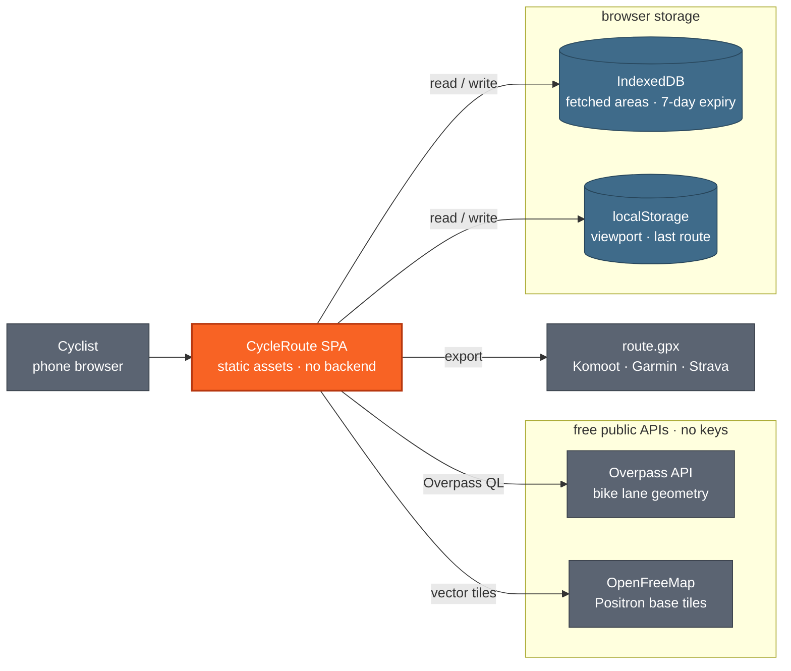
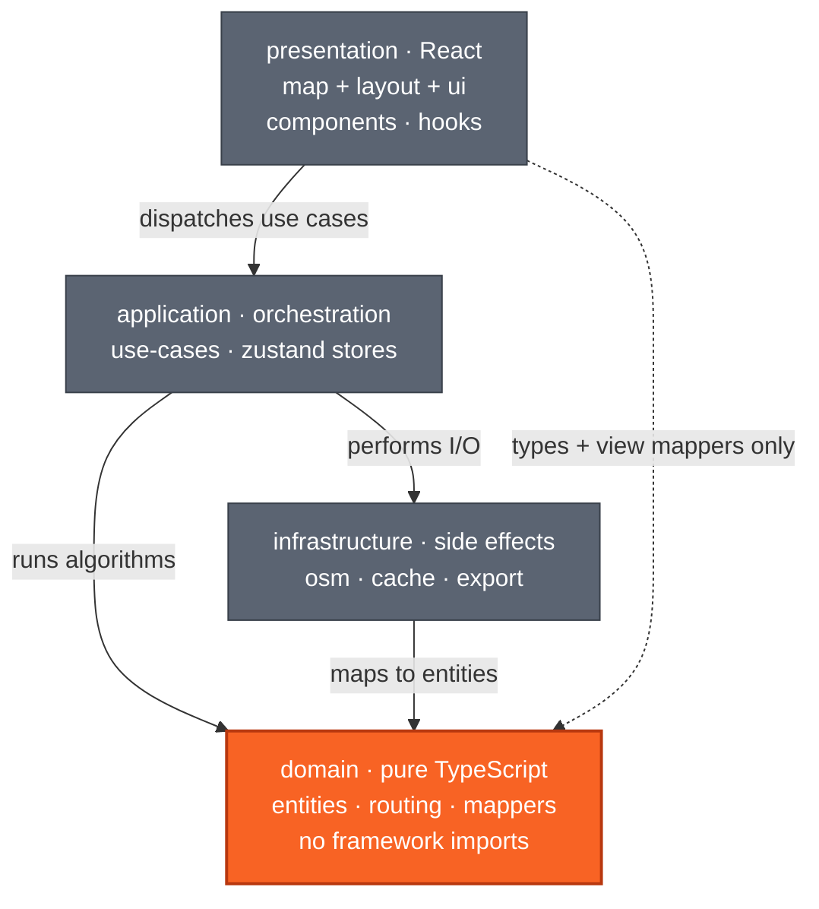

# Architecture

This document describes the architecture of CycleRoute **as it exists today**. Where the
implementation differs from the intent stated in the README, the difference is called out
explicitly and carries a link to the corresponding item in [`/backlog`](../backlog/README.md).

- [Algorithms](algorithms.md) — the mathematics of graph construction and route finding
- [Features & use cases](features.md) — what the app does from a user's point of view
- [Development guidelines](development.md) — conventions and the scenario-first algorithm workflow
- [Backlog](../backlog/README.md) — pending work

---

## 1. Shape of the system

CycleRoute is a **client-only single-page application**. There is no backend, no server-side
rendering and no build-time data. Every byte of map data is fetched from a public API at runtime
and stored in the browser.



`react-router.config.ts` sets `ssr: false`, so React Router acts purely as a client-side router
and build tool. The production bundle is a static site served under the `/cycler/` base path
(GitHub Pages, or the bundled nginx image).

Both external services are free, unauthenticated and rate-limited — see
[`18-overpass-resilience`](../backlog/18-overpass-resilience.md).

---

## 2. Layers

The project follows a **simplified Clean Architecture**: four layers with a strict
inward-pointing dependency rule. The domain layer has zero framework imports, which is what makes
the routing mathematics testable without a browser, a map or a network.



### What lives where

| Layer | Modules | Depends on |
|---|---|---|
| `domain` | `entities/` (BikeLane, Route, RoutePreferences, CachedArea) · `routing/` (graph, route-finder, algorithms) · `mappers/` (osm-to-domain, geojson-from-domain) | nothing in-app; only `geojson` types, `graphology`, `@turf/turf` |
| `infrastructure` | `osm/` (overpass-client, queries) · `cache/` (db, area-cache) · `export/` (gpx) | `domain/entities` |
| `application` | `use-cases/` (fetchBikeLanes, buildRoute) · `stores/` (map-store, routing-store) | `domain`, `infrastructure` |
| `presentation` | `components/map` · `components/layout` · `components/ui` · `hooks/` | `application`, plus domain types and view mappers |

### Deliberate shortcuts

Two places where the layering is thinner than the diagram suggests. Both are intentional; the
second is worth revisiting.

- **`presentation` reaches into `domain` and `infrastructure` for pure formatting.**
  `BikeLaneLayer` and `RouteLayer` import `domain/mappers/geojson-from-domain`, and `BottomSheet`
  imports `infrastructure/export/gpx`. Both are pure functions with no orchestration, so routing
  them through a use case would buy nothing.
- **`useBikeLanes` bypasses the application layer.** It calls `loadAllAreas()` from
  infrastructure directly on mount, and calls `clearRouteCache()` from the *route* use case —
  coupling two use cases through a hook. See
  [`19-cache-bypassed-on-fetch`](../backlog/19-cache-bypassed-on-fetch.md).

### Why not full hexagonal architecture

There is no backend and no second adapter for anything — one Overpass client, one IndexedDB
store, one GPX writer. Defining ports and injecting adapters would add indirection with no
substitution ever taking place. The domain is isolated because the *algorithms* benefit from
being testable in isolation, not because the I/O might change.

---

## 3. Runtime flows

### 3.1 Loading bike lanes

Triggered by **Load Bike Lanes**. Always hits the network — the IndexedDB cache is only consulted
on app start.

1. `useBikeLanes` reads the current `bbox` from `map-store` (written by `CycleMap` on every move).
2. `bboxDimensionsKm` rejects anything larger than 50 × 50 km with a "zoom in closer" message.
3. `fetchBikeLanes(bbox, forceRefresh = true)` builds an Overpass QL query via
   `buildBikeLaneQuery` and posts it through `overpass-client`.
4. The OSM JSON response is converted by `osmtogeojson`, then by `geojsonToBikeLanes` into
   `BikeLane[]` — LineString features only, everything else discarded.
5. The area is written to IndexedDB keyed by a bbox id rounded to 3 decimals.
6. `setBikeLanes` updates the store, the overlay redraws, and `clearRouteCache()` discards stale
   route batches.

On mount, a separate effect calls `loadAllAreas()`, drops entries older than 7 days, and flattens
**every** surviving area into the store — so a returning user sees previously fetched cities with
no network call.

### 3.2 Suggesting a route

Triggered by **Suggest Route**.

1. `setCalculating(true)`, then `await setTimeout(0)` so the spinner paints before the synchronous
   graph work begins.
2. The start point comes from `navigator.geolocation` with a 3 s timeout, falling back to the map
   viewport centre. A denied permission is a fallback, not an error.
3. `buildRoute` looks for a cached batch keyed on `(lon, lat, maxGapMeters)` at ~100 m precision.
4. On a miss, `findRoutes` builds the graph, runs the selected strategy from every lane endpoint
   within `startProximityMeters` of the start, and deduplicates by route signature.
5. If fewer than 3 routes emerged, the graph is rebuilt at a 1 000 m gap tolerance and the
   strategy re-run — see [`01`](../backlog/01-gap-penalty-and-tolerance.md).
6. The batch is shuffled once and cached; the first route is returned and drawn.

**New Route** re-enters the same path and the cache serves the next route from the batch, so
repeated taps cycle through every candidate before repeating.

### 3.3 Exporting GPX

`BottomSheet` calls `downloadGpx(route)` directly. Every coordinate of every segment is flattened
into a single `<trkseg>`, wrapped in a Blob and handed to a synthetic `<a download>` click. No
elevation, no timestamps, no lane/gap distinction, and no XML escaping of the track name —
[`20-gpx-hardening`](../backlog/20-gpx-hardening.md).

---

## 4. State and persistence

Two Zustand stores, both wrapped in the `persist` middleware, both persisting only a slice of
their state to `localStorage`.

| Store slice | Where it lives | Survives reload | Notes |
|---|---|---|---|
| `viewport` | localStorage (`cycle-map-viewport`) | yes | Restores the last map position |
| `bbox`, `isLoading`, `fetchError`, `lastFetchedAt` | memory | no | Excluded from `partialize` |
| `bikeLanes` | IndexedDB (`cycle-app` → `areas`) | yes, on mount | Areas older than 7 days are filtered out but never deleted |
| `currentRoute` | localStorage (`cycle-routing`) | yes, but degraded | `createdAt` rehydrates as a `string`, not a `Date` — [`15`](../backlog/15-persisted-route-rehydration.md) |
| `preferences` | localStorage (`cycle-routing`) | yes | Gap tolerance, routing mode and destination are editable |
| route batches | module-level `Map` in `build-route.ts` | no | Cleared when new lane data arrives |

The route batch cache is deliberately mutable module state, so **New Route** is instant. It is
an LRU bounded to 20 entries and keyed on every routing preference. Start coordinates are rounded
to three decimal places so close-enough starts can reuse the same batch. Because cached results
also depend on the lane data, loading new lanes clears the cache explicitly.

---

## 5. Domain model

| Entity | Fields |
|---|---|
| `BikeLane` | `id`, `osmId`, `geometry: LineString`, `laneType`, `name?`, `surface?`, `tags` |
| `LaneType` | `cycleway` · `lane` · `track` · `shared` · `path` |
| `CachedArea` | `id`, `bbox: BoundingBox`, `bikeLanes: BikeLane[]`, `fetchedAt: Date` |
| `Route` | `id`, `segments: RouteSegment[]`, `totalDistanceMeters`, `bikeLaneDistanceMeters`, `bikeLaneCoverage`, `gapCount`, `createdAt` |
| `RouteSegment` | `geometry: LineString`, `type: 'bike_lane' \| 'gap'`, `distanceMeters` |
| `RoutePreferences` | `startLon`, `startLat`, `endLon?`, `endLat?`, `maxGapMeters`, `startProximityMeters`, `minDistanceMeters`, `maxDistanceMeters`, `roundTrip` |

The typed `RouteSegment.type` is what makes the product's premise expressible: every route knows
which parts of it are on dedicated infrastructure and which are not.

`RoutePreferences` doubles as the routing-mode selector — see below.

---

## 6. Routing strategy extension point

`route-finder.ts` exposes a `RoutingStrategy` interface. Adding a routing mode means writing one
implementation and one line in `buildStrategy`; no other file changes.

```ts
interface RoutingStrategy {
  findRoutes(graph: BikeLaneGraph, startKey: string): Route[]
}
```

`buildStrategy(preferences, endKey?)` selects between three implementations:

| Selected when | Strategy | Algorithm |
|---|---|---|
| `endLon` + `endLat` set | `oneWayStrategy` | bidirectional Dijkstra, single shortest path |
| `roundTrip: true` | `roundTripStrategy` | edge-disjoint random walk returning to start |
| neither | `exploreStrategy` | node-disjoint random walk |

`executeWithCandidates` then runs the chosen strategy from every start node within
`startProximityMeters` and deduplicates across all of them. Full treatment in
[algorithms.md §5](algorithms.md).

All three strategies are reachable from the preferences section. Destination coordinates can be
set by map-pick mode, touch long-press, or desktop right-click.

---

## 7. Technology decisions

| Concern | Choice | Why |
|---|---|---|
| Framework | React 19 + React Router 8 (SPA mode, `ssr: false`) | Familiar routing/build pipeline; SSR is pointless with no backend |
| Build | Vite 8 | Fast HMR, first-class React Router integration |
| Map rendering | `maplibre-gl` 6 + `react-map-gl` 8 | GPU-accelerated vector rendering, handles thousands of lane LineStrings |
| Base map | OpenFreeMap Positron | Free, no API key, muted palette that lets the orange overlay dominate |
| OSM data | Overpass API + `osmtogeojson` | CORS-friendly, no key, best coverage of `cycleway:*` tagging |
| Geospatial | `@turf/turf` | `turf.length` for geodesic lane length |
| Graph | `graphology` + `graphology-shortest-path` | Typed graph with edge attributes; bidirectional Dijkstra built in |
| State | `zustand` + `persist` | Two small stores, no provider nesting |
| Persistence | `idb` | Typed IndexedDB wrapper; GeoJSON blobs exceed localStorage limits |
| Styling | Tailwind CSS v4 (`@tailwindcss/vite`) | Zero runtime, CSS-first `@theme` config |
| Icons | `lucide-react` | Tree-shakeable |
| Tests | `vitest` + jsdom | Shares the Vite config; Jest-compatible API |

> The README previously listed **Radix primitives** as the UI foundation. There is no
> `@radix-ui/*` dependency; the only primitive is a hand-written `Button`. Tracked in
> [`24-metadata-and-dependency-claims`](../backlog/24-metadata-and-dependency-claims.md).

---

## 8. Build, deploy, quality gates

`npm run check` is the full gate, run in order:
`format:check` → `lint` → `typecheck` (`react-router typegen && tsc`) → `test` → `build` →
`security:check` (`npm audit --audit-level=high`).

`npm run build` emits a static site to `build/client`. From there:

- `npm run deploy` publishes it to GitHub Pages via `gh-pages`.
- The committed `Dockerfile` builds it in `node:24-alpine` and serves it from
  `nginx:stable-alpine` using `nginx.conf`.

The base path `/cycler/` is set in **two** places that must stay in sync: `vite.config.ts`
(`base`, keyed on `command`) and `react-router.config.ts` (`basename`, keyed on `NODE_ENV`).

Supply-chain policy lives in the repository-level `.npmrc`: a 3-day minimum release age,
`strict-allow-scripts`, no git/file/URL specifiers, `save-exact`, and `strict-peer-deps`.
`package.json` carries an empty `allowScripts` allow-list and one `overrides` pin
(`@xmldom/xmldom`).

---

## 9. Known architectural gaps

Each is a task in [`/backlog`](../backlog/README.md).

| Gap | Impact | Task |
|---|---|---|
| Gap edges are unweighted; tolerance is silently widened | The core bike-lane-first guarantee is not enforced | [01](../backlog/01-gap-penalty-and-tolerance.md) |
| Graph nodes exist only at lane **endpoints** | Lanes meeting mid-way are never connected; the network is more fragmented than reality | [09](../backlog/09-mid-lane-junctions.md) |
| Gap detection is O(n²) over all nodes | City-scale fetches block the main thread for seconds | [16](../backlog/16-spatial-index.md), [17](../backlog/17-web-worker.md) |
| Distance preferences have no UI | Distance configuration is unreachable | [05](../backlog/05-route-preferences-ui.md) |
| Overpass has one endpoint, no retry, no abort | A 429 or 504 surfaces as a raw error and loses the request | [18](../backlog/18-overpass-resilience.md) |
| IndexedDB cache is bypassed on every fetch | Every button press re-queries Overpass | [19](../backlog/19-cache-bypassed-on-fetch.md) |
| No tests above the domain layer | Use cases, stores, hooks and infrastructure are unverified | [22](../backlog/22-use-case-tests.md) |
