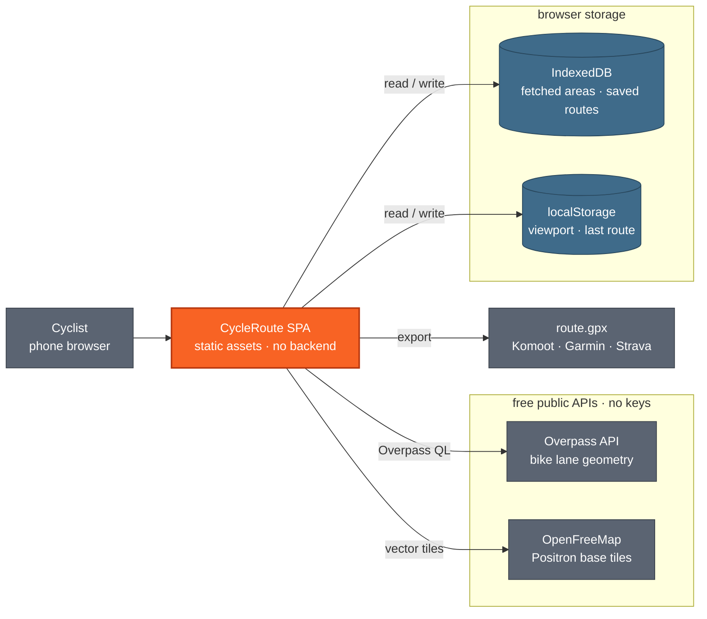
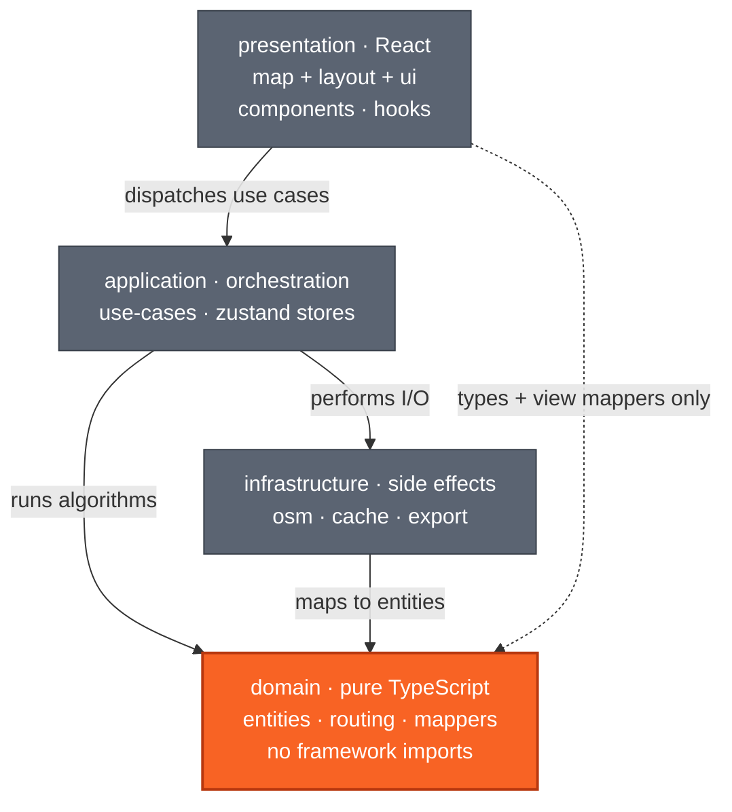

# Architecture

This document describes the architecture of CycleRoute **as it exists today**. Where the
implementation differs from the intent stated in the README, the difference is called out
explicitly and carries a link to the corresponding item in [`/backlog`](../backlog/README.md).

- [Algorithms](algorithms.md) — the mathematics of graph construction and route finding
- [Features & use cases](features.md) — what the app does from a user's point of view
- [Development guidelines](development.md) — conventions and the scenario-first algorithm workflow
- [Backlog](../backlog/README.md) — pending work

---

## 1. Shape of the system

CycleRoute is a **client-only single-page application**. There is no backend, no server-side
rendering and no build-time data. Every byte of map data is fetched from a public API at runtime
and stored in the browser.



`react-router.config.ts` sets `ssr: false`, so React Router acts purely as a client-side router
and build tool. The production bundle is a static site served under the `/cycler/` base path
(GitHub Pages, or the bundled nginx image).

Both external services are free, unauthenticated and rate-limited. Overpass requests are
serialised and use bounded retries plus mirror fallback — see
[`18-overpass-resilience`](../backlog/done/18-overpass-resilience.md).

---

## 2. Layers

The project follows a **simplified Clean Architecture**: four layers with a strict
inward-pointing dependency rule. The domain layer has zero framework imports, which is what makes
the routing mathematics testable without a browser, a map or a network.



### What lives where

| Layer | Modules | Depends on |
|---|---|---|
| `domain` | `entities/` (BikeLane, Barrier, Route, SavedRoute, RoutePreferences, CachedArea) · `routing/` (graph, spatial-index, route-finder, search, random, algorithms, barriers) · `mappers/` (osm-to-domain, osm-to-barriers, geojson-from-domain) | nothing in-app; only `geojson` types, `graphology`, `@turf/turf` |
| `infrastructure` | `osm/` (overpass-client, queries) · `cache/` (db, area-cache, route-store) · `export/` (gpx) · `workers/` (routing.worker, routing-client, routing-protocol) | `domain/entities`, and `domain/routing` from the worker |
| `application` | `use-cases/` (fetchArea, loadCachedLanes, buildRoute, manageSavedRoutes) · `stores/` (map-store, routing-store) | `domain`, `infrastructure` |
| `presentation` | `components/map` · `components/layout` · `components/ui` · `hooks/` | `application`, plus domain types and view mappers |

### Deliberate shortcut

- **`presentation` reaches into `domain` and `infrastructure` for pure formatting.**
  `BikeLaneLayer` and `RouteLayer` import `domain/mappers/geojson-from-domain`, and `BottomSheet`
  imports `infrastructure/export/gpx`. Both are pure functions with no orchestration, so routing
  them through a use case would buy nothing.

### Why not full hexagonal architecture

There is no backend and no second adapter for anything — one Overpass client, one IndexedDB
store, one GPX writer. Defining ports and injecting adapters would add indirection with no
substitution ever taking place. The domain is isolated because the *algorithms* benefit from
being testable in isolation, not because the I/O might change.

---

## 3. Runtime flows

### 3.1 Loading bike lanes

Triggered by **Load Bike Lanes**. A fresh cached area is returned immediately; **Refresh** is the
explicit network-only path.

1. `useBikeLanes` reads the current `bbox` from `map-store` (written by `CycleMap` on every move).
2. `bboxDimensionsKm` rejects anything larger than 50 × 50 km with a "zoom in closer" message.
3. `fetchArea(bbox)` first looks for the exact cache key, then for the smallest fresh cached bbox
   that fully contains the request. Entries expire after seven days. A hit returns without a
   network call; **Refresh** skips both lookups.
4. On a miss, `fetchArea` builds an Overpass QL query via `buildBikeLaneQuery` and posts it through
   `overpass-client`. Requests are serialised, time out after 60 seconds, retry transient failures
   three times with backoff, and move through an ordered mirror list. The client honours
   `Retry-After`, rejects oversized or non-JSON responses, and exposes cancellation through an
   `AbortSignal`. The OSM JSON response is converted by `osmtogeojson`, then by
   `geojsonToBikeLanes` into `BikeLane[]` — LineString features only, everything else discarded.
5. A **second** query, `buildBarrierQuery`, fetches the major roads, railways, water and
   crossings for the same box, which `geojsonToBarriers` splits into `BarrierData`. This call is
   allowed to fail on its own: lanes are the product, and a failure yields `barriers: null`,
   which the route metrics report as "not checked" rather than passing off as verified.
6. The area — lanes and barriers together — is written to IndexedDB keyed by a bbox id rounded to
   3 decimals. A browser that refuses the database, or a write that fails, is logged and
   ignored — see §4.1.
7. `mergeAreas` adds the area to the ones already held, the overlay redraws,
   `clearRouteCache()` discards stale route batches, and the header identifies cached versus
   refreshed data.

### 3.1.1 What is held, and what is drawn

The store holds **areas**, not a flat list of lanes: `bikeLanes` and `barriers` are derived from
`areas` once per change. Two boxes decide which areas that is and how much of them reaches the
map, both recomputed when the map settles (`onMoveEnd`) rather than on every frame:

| Bound | Where | Margin | What it decides |
|---|---|---|---|
| Load | `useBikeLanes` | 1 view in each direction | Which cached areas are read out of IndexedDB and held in memory — and therefore what the router is given |
| Render | `BikeLaneLayer` | ¼ view in each direction | Which of the held lanes are handed to MapLibre as a GeoJSON source |

Areas outside the load bound are dropped from memory but stay in IndexedDB, and come back when the
rider moves there. On the Warsaw city extract (10 777 lanes, 3.31 MB of GeoJSON) the render bound
hands MapLibre 225 lanes at zoom 15 and 1 934 at zoom 13; at zoom 11 the whole city is on screen
and it hands over all of it, which is the right answer.

**The router is given exactly the held set** — every lane in every loaded area, nothing more and
nothing less. A route can therefore stop at the edge of what has been fetched, which is a property
of the data rather than of the search.

### 3.1.2 The mount path

`initializeLaneCache` deletes entries older than seven days. Then `loadCachedLanes` lists cached
areas **by key** (`listAreaBounds`, which parses the box out of the id and deserialises nothing),
keeps those intersecting the load bound, and merges the rest — so a returning user sees the lanes
around them with no network call, and the cities they are not looking at cost nothing.

### 3.2 Suggesting a route

Triggered by **Suggest Route**.

1. `useRoute` numbers the request and sets `isCalculating`. Only the latest request may write
   to the store when it settles; an older one that finishes later is dropped.
2. `buildRoute` resolves the start point: a point picked on the map (`startLon`/`startLat` in
   the preferences) wins; otherwise `locateDevice` (`infrastructure/geolocation/`) asks
   `navigator.geolocation` with a 3 s timeout, and the map viewport centre stands in when it does
   not answer. A denied permission is a fallback, not an error. The result carries which of the
   three was used (`StartSource`), and the sheet says so next to the metrics.
3. `buildRoute` looks for a cached batch keyed on every routing preference, with the start at
   ~100 m precision.
4. On a miss, `postRouteRequest` clones the lanes, barriers and preferences into the routing
   worker (`infrastructure/workers/`), where `findRoutes` builds the graph, runs the selected
   strategy from every lane endpoint within `startProximityMeters` of the start, and
   deduplicates by canonical node-sequence signature. The worker posts progress after the graph
   build and after each start candidate; the button fills to match. The main thread stays free,
   so the map keeps panning.
5. If fewer than 3 routes emerged, the graph is rebuilt at a 1 000 m gap tolerance and the
   strategy re-run — see [`01`](../backlog/done/01-gap-penalty-and-tolerance.md).
6. The batch is shuffled once and cached; the first route is returned and drawn.

**New Route** re-enters the same path and the cache serves the next route from the batch, so
repeated taps cycle through every candidate before repeating.

**Tapping again while computing** abandons the running search: the client terminates the worker,
rejects the earlier promise with `RouteRequestCancelledError`, and starts a fresh worker for the
new request. **Cancel** does the same without starting another. When no `Worker` can be
constructed, or the worker script fails to load, the client runs `findRoutes` on the main
thread after one `setTimeout(0)` yield so the spinner paints — the same code path the tests take
under jsdom.

### 3.3 Saving and restoring routes

The bookmark action asks for a name, defaulting to distance, route shape and date, then
`manage-saved-routes` stores the complete route in IndexedDB. The `routes` store is keyed by the
route id and indexed by `savedAt`, so the bottom sheet restores its newest-first list on mount.
Selecting an entry puts that route back into `routing-store`; export reads the saved route
directly, without changing the active route. Deletion is confirmed first.

At most 50 distinct routes may be saved. Saving the same route again updates its name and save
date; saving a new one at the limit is refused with an actionable message. Nothing is evicted
silently.

### 3.4 Exporting GPX

`BottomSheet` calls `downloadGpx(route)` directly. The exporter writes GPX 1.1 metadata, bounds,
and one `<trkseg>` per contiguous lane or gap run. A namespaced extension preserves each run's
type, repeated source-segment joins are removed, and user-visible text is XML-escaped. The Blob is
downloaded through a temporary attached anchor with a route-specific filename. See
[`20-gpx-hardening`](../backlog/done/20-gpx-hardening.md).

---

## 4. State and persistence

Two Zustand stores, both wrapped in the `persist` middleware, both persisting only a slice of
their state to `localStorage`.

| Store slice | Where it lives | Survives reload | Notes |
|---|---|---|---|
| `viewport` | localStorage (`cycle-map-viewport`) | yes | Restores the last map position |
| `bbox`, `isLoading`, `fetchError`, `lastFetchedAt` | memory | no | Excluded from `partialize` |
| `areas` | IndexedDB (`cycle-app` → `areas`) | yes, those near the view | Areas older than 7 days are deleted on startup and re-fetched on access |
| saved routes | IndexedDB (`cycle-app` → `routes`) | yes | Complete named routes, newest first, capped at 50 |
| `bikeLanes` | derived from `areas` | — | Recomputed once per area change, not per read |
| `barriers` | derived from `areas` | — | Null unless **every** held area has them, so a partly unchecked set is never reported as checked |
| `currentRoute` | localStorage (`cycle-routing`) | yes, but degraded | `createdAt` rehydrates as a `string`, not a `Date` — [`15`](../backlog/15-persisted-route-rehydration.md) |
| `preferences` | localStorage (`cycle-routing`) | yes | Gap tolerance, routing mode and destination are editable |
| route batches | module-level `Map` in `build-route.ts` | no | Cleared when new lane data arrives |

### 4.1 When storage is refused

IndexedDB is not always available. A private window, blocked site data or a disabled storage API
make `indexedDB.open()` reject — Firefox with "The user denied permission to access the
database." A write can also fail after a successful open, on quota or eviction.

`tryGetDb` resolves to `null` in that case instead of throwing. Every `area-cache` function
degrades to "no cache": `saveArea` returns `false`, `loadArea` returns `undefined`, and
`loadAllAreas` returns `[]`. Route reads likewise return nothing; save and delete actions fail
with a visible message instead of claiming success. The app then refetches every area from
Overpass and keeps nothing in IndexedDB between sessions, but loading lanes and building routes
still work. The refusal is remembered for the session, so the browser is asked once per page load
and one warning reaches the console.

The route batch cache is deliberately mutable module state, so **New Route** is instant. It is
an LRU bounded to 20 entries and keyed on every routing preference. Start coordinates are rounded
to three decimal places so close-enough starts can reuse the same batch. Because cached results
also depend on the lane data, loading new lanes clears the cache explicitly.

---

## 5. Domain model

| Entity | Fields |
|---|---|
| `BikeLane` | `id`, `osmId`, `geometry: LineString`, `laneType`, `name?`, `surface?`, `tags` |
| `LaneType` | `cycleway` · `lane` · `track` · `shared` · `path` |
| `CachedArea` | `id`, `bbox: BoundingBox`, `bikeLanes: BikeLane[]`, `fetchedAt: Date` |
| `Route` | `id`, `segments: RouteSegment[]`, `totalDistanceMeters`, `bikeLaneDistanceMeters`, `bikeLaneCoverage`, `gapCount`, `createdAt` |
| `RouteSegment` | `geometry: LineString`, `type: 'bike_lane' \| 'gap'`, `distanceMeters` |
| `RoutePreferences` | `startLon?`, `startLat?`, `endLon?`, `endLat?`, `maxGapMeters`, `startProximityMeters`, `minDistanceMeters`, `maxDistanceMeters`, `roundTrip` |
| `ResolvedRoutePreferences` | `RoutePreferences` with `startLon` and `startLat` required — what `findRoutes` and the worker receive |

The typed `RouteSegment.type` is what makes the product's premise expressible: every route knows
which parts of it are on dedicated infrastructure and which are not.

`RoutePreferences` doubles as the routing-mode selector — see below.

---

## 6. Routing strategy extension point

`route-finder.ts` exposes a `RoutingStrategy` interface. Adding a routing mode means writing one
implementation and one line in `buildStrategy`; no other file changes.

```ts
interface RoutingStrategy {
  findRoutes(graph: BikeLaneGraph, startKey: string): Route[]
}
```

`buildStrategy(preferences, seed, endKey?)` selects between three implementations:

| Selected when | Strategy | Algorithm |
|---|---|---|
| `endLon` + `endLat` set | `oneWayStrategy` | A* with a Haversine heuristic, single cheapest path |
| `roundTrip: true` | `roundTripStrategy` | far points cast around the start; a path out and an edge-disjoint path back |
| neither | `exploreStrategy` | one bounded shortest-path tree; the cheapest path to a destination in each direction |

`executeWithCandidates` then runs the chosen strategy from every start node within
`startProximityMeters` and deduplicates across all of them. Full treatment in
[algorithms.md §5](algorithms.md).

All three strategies are reachable from the preferences section. Start and destination
coordinates can be set by map-pick mode, touch long-press, or desktop right-click; while a start is
being chosen the gesture serves the start, otherwise the destination. An unset start means the
device position (see §3.2).

---

## 7. Technology decisions

| Concern | Choice | Why |
|---|---|---|
| Framework | React 19 + React Router 8 (SPA mode, `ssr: false`) | Familiar routing/build pipeline; SSR is pointless with no backend |
| Build | Vite 8 | Fast HMR, first-class React Router integration |
| Map rendering | `maplibre-gl` 6 + `react-map-gl` 8 | GPU-accelerated vector rendering, handles thousands of lane LineStrings |
| Base map | OpenFreeMap Positron | Free, no API key, muted palette that lets the orange overlay dominate |
| OSM data | Overpass API + `osmtogeojson` | CORS-friendly, no key, best coverage of `cycleway:*` tagging |
| Geospatial | `@turf/turf` | `turf.length` for geodesic lane length |
| Graph | `graphology` | Typed graph with edge attributes; the searches are hand-written in `routing/search.ts` (`graphology-shortest-path` is still listed in `package.json` but no longer imported) |
| State | `zustand` + `persist` | Two small stores, no provider nesting |
| Persistence | `idb` | Typed IndexedDB wrapper; GeoJSON blobs exceed localStorage limits |
| Styling | Tailwind CSS v4 (`@tailwindcss/vite`) | Zero runtime, CSS-first `@theme` config |
| Icons | `lucide-react` | Tree-shakeable |
| Tests | `vitest` + jsdom | Shares the Vite config; Jest-compatible API |

> The README previously listed **Radix primitives** as the UI foundation. There is no
> `@radix-ui/*` dependency; the only primitive is a hand-written `Button`. Tracked in
> [`24-metadata-and-dependency-claims`](../backlog/24-metadata-and-dependency-claims.md).

---

## 8. Build, deploy, quality gates

`npm run check` is the full gate, run in order:
`format:check` → `lint` → `typecheck` (`react-router typegen && tsc`) → `test` → `build` →
`security:check` (`npm audit --audit-level=high`).

`npm run build` emits a static site to `build/client`. From there:

- `npm run deploy` publishes it to GitHub Pages via `gh-pages`.
- The committed `Dockerfile` builds it in `node:24-alpine` and serves it from
  `nginx:stable-alpine` using `nginx.conf`.

The base path `/cycler/` is set in **two** places that must stay in sync: `vite.config.ts`
(`base`, keyed on `command`) and `react-router.config.ts` (`basename`, keyed on `NODE_ENV`).
The routing worker is bundled by Vite from `new Worker(new URL('./routing.worker.ts',
import.meta.url), { type: 'module' })` into its own `assets/routing.worker-*.js` chunk, and the
built URL carries the base path — check that chunk after changing either setting.

Supply-chain policy lives in the repository-level `.npmrc`: a 3-day minimum release age,
`strict-allow-scripts`, no git/file/URL specifiers, `save-exact`, and `strict-peer-deps`.
`package.json` carries an empty `allowScripts` allow-list and one `overrides` pin
(`@xmldom/xmldom`).

---

## 9. Known architectural gaps

Each is a task in [`/backlog`](../backlog/README.md).

| Gap | Impact | Task |
|---|---|---|
| Gap edges are unweighted; tolerance is silently widened | The core bike-lane-first guarantee is not enforced | [01](../backlog/done/01-gap-penalty-and-tolerance.md) |
| Graph nodes exist only where lanes **share a vertex** | Lanes that cross without a shared OSM node are not connected | follow-up of [09](../backlog/done/09-mid-lane-junctions.md) |
| Distance preferences have no UI | Distance configuration is unreachable | [05](../backlog/05-route-preferences-ui.md) |
| No tests above the domain layer | Use cases, stores, hooks and infrastructure are unverified | [22](../backlog/22-use-case-tests.md) |
