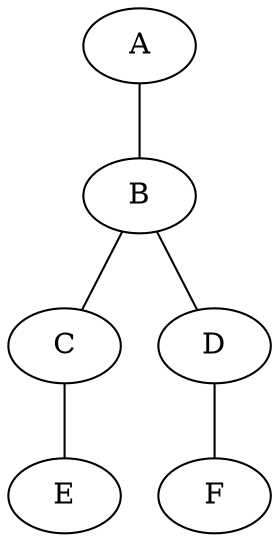
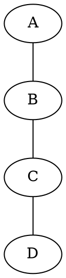

# Development guidelines

How to work in this codebase: where new code goes, the TypeScript and React conventions in use,
and — most importantly — **how route-finding algorithms are developed here**, which is
scenario-first and non-negotiable.

Written for humans and for AI agents. If you are an agent picking up a task from
[`/backlog`](../backlog/README.md), read §4 before touching anything under `app/domain/routing/`.

Companion documents: [Architecture](architecture.md) · [Algorithms](algorithms.md) ·
[Features & use cases](features.md)

---

## 1. Ground rules

Five things that hold everywhere.

1. **The domain layer imports no framework.** No React, no `fetch`, no `window`, no `idb`. If a
   change to `app/domain/` needs one of those, the change belongs in another layer.
2. **Algorithms are proven by isolated scenarios before they are written.** See §4.
3. **`npm run check` passes before every commit.** It is the same gate CI runs.
4. **Never hand-format.** Prettier owns whitespace; run `npm run format`.
5. **A comment that no longer matches the code is worse than no comment.** The repo has a backlog
   item ([23](../backlog/23-stale-docstrings.md)) that exists purely because this was not
   followed.

---

## 2. Where new code goes

Follow the dependency rule: `presentation → application → infrastructure → domain`. Nothing ever
points back outward.

| If you are adding… | It goes in | And it must not |
|---|---|---|
| A routing algorithm, graph operation, geometry calculation | `app/domain/routing/` | touch I/O, React, or globals |
| A new concept with identity or invariants (a route, a lane) | `app/domain/entities/` | contain behaviour that needs I/O |
| A conversion between an external format and a domain type | `app/domain/mappers/` | fetch anything |
| A call to a network API | `app/infrastructure/osm/` | know about React or stores |
| Reading or writing browser storage | `app/infrastructure/cache/` | contain business rules |
| A file-format serialiser (GPX, TCX…) | `app/infrastructure/export/` | reach into stores |
| A multi-step operation that coordinates the above | `app/application/use-cases/` | render anything |
| Shared UI state | `app/application/stores/` | contain algorithms |
| A React component | `app/presentation/components/` | compute routes or call APIs directly |
| A bridge between stores and components | `app/presentation/hooks/` | contain algorithms |

### Layer responsibilities in one line each

- **domain** — pure functions and types. Deterministic given inputs (the routing walks use
  `Math.random()`, which is a known wart; see [02](../backlog/02-astar-routing.md)).
- **infrastructure** — everything that can fail because the outside world exists. Network,
  storage, files. Each module owns one external system and exports a typed error.
- **application** — orchestration. Use cases sequence infrastructure and domain calls; stores hold
  state. No business rules that belong in the domain.
- **presentation** — rendering and user input. Components read stores and dispatch use cases.

### Two existing shortcuts, and whether to copy them

`presentation` imports `domain/mappers/geojson-from-domain` and `infrastructure/export/gpx`
directly. **Copy this** for pure formatting functions — wrapping a one-line serialiser in a use
case buys nothing.

`useBikeLanes` calls `loadAllAreas()` from infrastructure and `clearRouteCache()` from another
use case. **Do not copy this** — it is tracked as
[19](../backlog/19-cache-bypassed-on-fetch.md). Hooks call use cases; use cases call
infrastructure.

### Adding a dependency

The repo-level `.npmrc` enforces a 3-day minimum release age, blocks unreviewed install scripts,
forbids git/file/URL specifiers, and pins exact versions. Before adding anything: check whether
`@turf/turf` or `graphology` already does it. If you must add, review the source, maintainers and
changelog, then run `npm run check` and `npm run security:signatures`.

---

## 3. TypeScript and React conventions

These are what the repo's `tsconfig.json`, `eslint.config.js` and `.prettierrc` already enforce.
Nothing here is a matter of taste.

### TypeScript

- **`strict: true` and `verbatimModuleSyntax: true`.** Type-only imports must say so:
  ```ts
  import type { BikeLane } from '~/domain/entities/bike-lane'
  import { buildGraph } from './graph'
  ```
  `@typescript-eslint/consistent-type-imports` will fail the build otherwise.
- **`interface` for object shapes, `type` for unions.** As in `interface BikeLane` vs
  `type LaneType = 'cycleway' | 'lane' | ...`.
- **Explicit return types on exported domain functions.** They are the contract; inference hides
  accidental widening.
- **No `any`.** The rule is `warn`, not `error`, but the only two uses in the codebase are
  MapLibre filter expressions in `RouteLayer.tsx`, each with a narrow `eslint-disable-next-line`
  on the line above. That is the sanctioned pattern: disable for one line, never for a file.
- **Prefix intentionally unused parameters with `_`** — `argsIgnorePattern: '^_'`, as in
  `meta(_: Route.MetaArgs)`.
- **Import across layers with `~/`, within a module with relative paths.**
  `~/domain/entities/route` from a hook; `./graph` from `route-finder.ts`.

### File naming — three conventions, by layer

| Location | Convention | Example |
|---|---|---|
| `domain/`, `application/`, `infrastructure/` | kebab-case | `route-finder.ts`, `map-store.ts` |
| `presentation/components/` | PascalCase, matching the component | `BottomSheet.tsx` |
| `presentation/hooks/` | camelCase, matching the hook | `useBikeLanes.ts` |

Named exports everywhere, except React Router route modules (`app/routes/*.tsx`), which require a
default export.

### React

- **Components render; they do not compute.** Anything more than formatting belongs in a hook,
  a use case, or the domain.
- **Prefer Zustand selectors over whole-store destructuring:**
  ```ts
  const bikeLanes = useMapStore(s => s.bikeLanes)      // re-renders on bikeLanes only
  const { bikeLanes, isLoading } = useMapStore()        // re-renders on ANY store change
  ```
  Both patterns exist today — `BottomSheet` uses selectors, `useBikeLanes` and `useRoute`
  destructure. New code uses selectors.
- **Only JSON-safe values in a persisted store slice.** `persist` serialises through
  `JSON.stringify`, so a `Date` rehydrates as a `string` while the type still claims `Date`. This
  is a live bug ([15](../backlog/15-persisted-route-rehydration.md)) — do not add to it.
- **`react-hooks/exhaustive-deps` is `warn`.** Do not silence it without a comment saying why.
  There is one such disable, in `useBikeLanes`, for a deliberate mount-only effect.
- **Synchronous work over ~50 ms freezes the map.** `useRoute` yields with
  `await new Promise(r => setTimeout(r, 0))` so the spinner paints before the graph build. That
  makes the spinner appear; it does not stop the freeze. For anything heavier, see
  [17](../backlog/17-web-worker.md).

### Formatting

No semicolons, single quotes, 100 columns, trailing commas, arrow parens avoided. Configured in
`.prettierrc`. Run `npm run format`.

---

## 4. Route-finding algorithms: the scenario-first workflow

**This is the most important section in the document.**

Route finding is the part of this app that is genuinely hard to reason about: the graph is built
from messy real-world geometry, two of three strategies are randomised, and failures are silent —
a subtly wrong algorithm returns a route that looks plausible on a map and is wrong. Debugging
that against a 5 000-lane city fetch is hopeless.

So the rule is: **every behaviour of a routing algorithm — normal cases and edge cases alike — is
expressed first as an isolated scenario on a graph small enough to draw in ASCII, with an explicit
statement of what the router must do.** Only then is the algorithm written.

### 4.1 The three test layers

Each answers a different question, and they are kept separate on purpose.

| Layer | Location | Question | Format |
|---|---|---|---|
| **geo → graph** | `scenarios/geo-to-graph/` | Does geometry become the right graph? | `.geojson` + `.expected.dot` pair |
| **graph → path** | `scenarios/graph-to-path/` | Given a graph, does the router find the right paths? | single `.dot` carrying graph **and** assertions |
| **integration** | `app/integration/` | Does it hold on real OSM data? | real Overpass export |

When adding an algorithm you will almost always work in **graph → path**. Touch geo → graph only
when you change `buildGraph`.

> Paths above are relative to `app/domain/routing/`, and change if
> [26](../backlog/26-separate-tests-from-source.md) lands.

### 4.2 The `graph-to-path` DSL

A scenario is a DOT file holding a graph, the routing parameters, and the expectations. Node
coordinates are assigned automatically along a line, so nodes are identified by name and route
results are reported back as name sequences.

Complete reference — everything `loadScenario` understands.

**Graph attributes** — inside `graph [ ... ]`:

| Attribute | Type | Default | Meaning |
|---|---|---|---|
| `description` | string | `""` | One-line summary, shown nowhere but read by everyone |
| `start` | node name | first edge's left node | Where routing begins |
| `end` | node name | — | **When set, switches to one-way routing** (Dijkstra) instead of random walks |
| `minDist` | number | `100` | Minimum acceptable route length, metres |
| `maxDist` | number | `100000` | Maximum acceptable route length, metres |
| `roundTrip` | `"true"` | false | Use the round-trip walk. Ignored when `end` is set |

**Expectations** — also graph attributes:

| Attribute | Type | Asserts |
|---|---|---|
| `expect_route` | `A,B,C` or `A,B,C;A,B,D` | **Every** listed node sequence appears in the results |
| `expect_any_route` | same syntax | **At least one** listed sequence appears |
| `expect_minRoutes` | int | At least N routes returned |
| `expect_maxRoutes` | int | At most N routes returned. `0` asserts none |
| `expect_isRoundTrip` | `"true"` | Some route starts and ends at the same node |
| `expect_hasGap` | `"true"` / `"false"` | Some route does / does not traverse a gap edge |
| `expect_maxGaps` | int | Every route's `gapCount` ≤ N |
| `expect_minCoverage` | float 0–1 | Every route's `bikeLaneCoverage` ≥ N |

**Edge attributes** — inside `A -- B [ ... ]`:

| Attribute | Type | Default | Meaning |
|---|---|---|---|
| `distance` | number | `0` | Edge length in metres |
| `type` | `lane` / `gap` | lane | Only the exact string `gap` marks a gap edge; anything else is a lane |

Edges are written with `--` (the graph is undirected). `//` comments are stripped before parsing.

### 4.3 Anatomy of a good scenario

`branching.dot`, in full, is the model to copy:



Four properties make it good, and all four are required of new scenarios:

1. **An ASCII sketch in the header.** The graph is legible without running anything. This is the
   single highest-value convention in the suite — keep it, and keep it accurate.
2. **A stated reason for each non-obvious parameter.** Not `minDist = 600`, but *why* 600: it
   forces the walk past the fork so the two routes differ in their third segment. A future reader
   changing that number knows what they are breaking.
3. **One property per scenario.** This file tests fork discovery. It does not also test gaps,
   distance bounds or loops. When a scenario fails, its name tells you what broke.
4. **The smallest graph that exhibits the property.** Six nodes. Not a realistic network — a
   proof.

### 4.4 Adding a routing algorithm

The order matters. Do not write the implementation first.

1. **List the properties** the algorithm must have — including what it must *refuse* to do.
2. **Write one `.dot` scenario per property**, following §4.3. Include the negative cases;
   `expect_maxRoutes = 0` is how you assert "must find nothing here".
3. **Register each scenario** with an `it(...)` in `graph-routing.test.ts`. Scenarios are **not**
   auto-discovered — a `.dot` file nobody registers is a file nobody runs.
4. **Extend `runScenario`** in that file if the new mode is not reachable via the existing
   `endKey` / `roundTrip` dispatch. This is the integration point for a new strategy.
5. **Run the suite and watch the new tests fail.** A scenario that passes before the algorithm
   exists is testing nothing. This step is not optional.
6. **Implement `RoutingStrategy`** in `route-finder.ts` and register it in `buildStrategy`. The
   interface is one method; no other file should need changing.
7. **Run again.** Green.
8. **Add an integration assertion** against the Warsaw fixture if the mode is user-reachable.
9. **Update [`docs/algorithms.md`](algorithms.md)** — pseudocode, complexity, and what the mode
   does *not* guarantee.

### 4.5 Edge cases every routing algorithm must have a scenario for

Work down this list. A tick means a fixture already exists and can be copied as a starting point;
the rest are gaps in the current suite and are worth adding as you go.

**Topology**

- ✅ Straight chain — `simple-chain.dot`
- ✅ Fork into two valid branches — `branching.dot`
- ✅ Dead-end branch the walk must back out of — `dead-end.dot`
- ✅ Disconnected components — `isolated-lanes.dot`
- ✅ Cycle returning to start — `round-trip.dot`
- ✅ Gap edge as the only connection — `gap-bridging.dot`
- ⬜ Start node with no edges at all
- ⬜ Single-node graph
- ⬜ Parallel edges between the same pair — currently dropped ([21](../backlog/21-dropped-lanes.md))
- ⬜ Self-loop / closed way — currently dropped ([21](../backlog/21-dropped-lanes.md))

**Distance bounds**

- ⬜ Route lands exactly on `minDist`
- ⬜ Best route falls just under `minDist` — must be rejected
- ⬜ A single edge longer than `maxDist − minDist` — must not overshoot
  ([11](../backlog/11-explore-distance-bounds.md))
- ⬜ `minDist = 0`
- ⬜ `minDist == maxDist`

**Gaps**

- ⬜ A route composed entirely of gaps — `bikeLaneCoverage === 0`
- ⬜ Two consecutive gap edges (`gapCount` counts edges, not crossings)
- ⬜ A shorter gap route against a slightly longer all-lane route — the all-lane route must win
  once [01](../backlog/01-gap-penalty-and-tolerance.md) lands
- ⬜ Zero gap tolerance

**Start and end**

- ⬜ `start == end` in one-way mode
- ⬜ Unreachable `end`
- ⬜ Several start candidates on the same loop

### 4.6 Pitfalls

Two ways to write a scenario that looks like a test and is not.

**Vacuous passes on an empty result.** Most expectations are skipped or vacuously satisfied when
the router returns nothing:

| Expectation | On zero routes |
|---|---|
| `expect_route`, `expect_any_route` | **fails** ✅ |
| `expect_minRoutes` | **fails** ✅ (unless 0) |
| `expect_maxRoutes` | passes |
| `expect_hasGap` | skipped |
| `expect_minCoverage` | skipped |
| `expect_isRoundTrip` | skipped |
| `expect_maxGaps` | vacuously passes |

So a scenario whose only assertion is `expect_minCoverage = 0.8` passes when the algorithm is
broken enough to return nothing at all. **Always pair a behavioural expectation with
`expect_route` or `expect_minRoutes`.**

**Flaky expectations under randomness.** Explore and round-trip are random walks, retried
`N_ATTEMPTS = 80` times per start candidate. On a six-node graph with two branches, the chance of
missing a path is about `2 × 2⁻⁸⁰` — zero in practice. On a graph with wide fan-out or long
paths, 80 attempts stop being exhaustive and `expect_route` starts failing intermittently.

- Keep scenarios small, and `expect_route` stays safe.
- If more than roughly five distinct valid routes exist, use `expect_any_route` or
  `expect_minRoutes` instead of demanding every sequence.
- One-way mode (`end` set) is deterministic Dijkstra — prefer exact `expect_route` there. But
  when two paths tie on length, which one wins is an implementation detail: use
  `expect_any_route`, as `one-way-branching.dot` does.

### 4.7 The `geo-to-graph` layer

Only when changing `buildGraph`. A scenario is a **pair** of files sharing a base name.

The `.geojson` is a normal `FeatureCollection` with two additions: a top-level `_maxGapMeters`
controlling gap insertion, and `_nodeStart` / `_nodeEnd` properties naming each lane's endpoints.

```json
{
  "_maxGapMeters": 100,
  "type": "FeatureCollection",
  "features": [
    {
      "type": "Feature",
      "properties": { "highway": "cycleway", "_nodeStart": "A", "_nodeEnd": "B" },
      "geometry": { "type": "LineString", "coordinates": [[0.0, 0.0], [0.001, 0.0]] }
    }
  ]
}
```

The `.expected.dot` declares the graph that must result. Node count is inferred from the distinct
names used, and `type=gap` marks a synthetic edge:



Use round coordinates and state the metric distance in the header comment, as above — reviewers
cannot convert degrees to metres in their heads, and getting it wrong is how a fixture ends up
asserting the wrong thing.

---

## 5. Testing beyond the algorithms

- Tests live in `*.test.ts`. Coverage is collected from `domain`, `application` and
  `infrastructure`.
- **Every new test must be able to fail.** Verify by temporarily breaking the code it covers. A
  test that passes against a deliberately broken implementation is worse than no test, because it
  buys false confidence.
- Prefer declarative fixtures over imperative setup wherever the pattern fits. The `.dot` and
  `.geojson` scenarios are the best thing in this suite; extend them rather than hand-building
  graphs in TypeScript.
- No test may touch the network. Verify by running the suite offline.
- Above the domain layer, use in-memory fakes for the Overpass client and `fake-indexeddb` for
  storage — see [22](../backlog/22-use-case-tests.md).

---

## 6. Before you commit

```bash
npm run check
```

Runs `format:check` → `lint` → `typecheck` → `test` → `build` → `security:check`, in that order.

Then confirm:

- New algorithm behaviour is covered by scenarios, and you watched them fail first.
- Any comment you touched still describes what the code does.
- Nothing in `app/domain/` imports a framework.
- If you changed a documented constant, limit or guarantee,
  [`docs/algorithms.md`](algorithms.md) §10 and [`docs/architecture.md`](architecture.md) still
  agree with the code.
