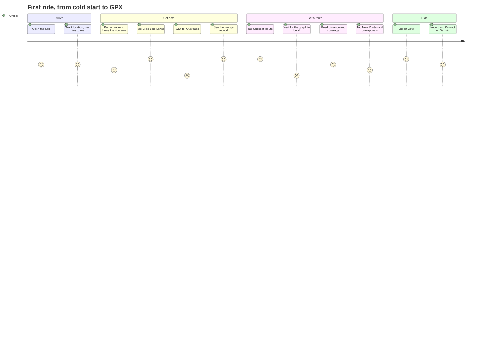

# Features & use cases

What CycleRoute does today, from the outside in — the screens, the flows, and the honest
boundary between what ships and what only exists in the domain layer.

Companion documents: [Architecture](architecture.md) · [Algorithms](algorithms.md) ·
[Development guidelines](development.md) · [Backlog](../backlog/README.md)

---

## 1. The problem

Urban cycling infrastructure is discontinuous. A protected path ends at an intersection, dumps
you onto a car road for 30 metres, then resumes on the other side. General-purpose routers treat
every road as equivalent and optimise for time; dedicated cycling routers optimise for
"bikeability" as a single blended score.

CycleRoute takes a narrower position: **the presence and continuity of cycling infrastructure is
the routing constraint, not a tiebreaker.** You declare how much on-road riding you will accept
between two lane segments, and the router works within that budget.

> **State of the premise.** The data model expresses this correctly — every route segment is
> typed `bike_lane` or `gap`, and every route reports its coverage ratio and gap count. The graph
> is now closer. [`27`](../backlog/done/27-gap-over-generation.md) pruned the gap edges that carry no
> connectivity: on the Warsaw fixture at the default tolerance they fell from 2 303 to 441.
> [`28`](../backlog/done/28-barrier-veto.md) then tested those against real geometry: 41 of the 441
> cross a major road, railway or waterway where no crossing is mapped, and the router now avoids
> them and tells the rider when it could not. Lanes on different levels are no longer bridged at
> all.
>
> [`01`](../backlog/done/01-gap-penalty-and-tolerance.md) closed the last step: a gap now costs the
> router 5–10× its length, so it prefers lanes because the cost function says so, and a route
> either respects the rider's gap tolerance or states on its face that it was widened. What
> `bikeLaneCoverage` still cannot tell you is how unpleasant the remaining gaps are — one number
> prices a quiet street and a four-lane road alike. Level of Traffic Stress is the model that
> would fix that, and it is not built.

---

## 2. Target user

One persona, deliberately:

> A city cyclist with a phone, standing somewhere in their own city, who wants a 10–30 km ride
> on bike paths this afternoon and will load it into Komoot or a Garmin before setting off.

Everything follows from that: mobile-first layout, no account, no server, geolocation as the
default start point, GPX as the exit route, and a bottom sheet you can work one-handed.

---

## 3. Feature status

| Feature | Status | Where it lives |
|---|---|---|
| Fetch bike lanes for the visible map area | **Shipped** | `fetchArea`, `useBikeLanes` |
| Render the lane network as an orange overlay | **Shipped** | `BikeLaneLayer` |
| Offline reuse of previously fetched areas | **Shipped** | `fetchArea`, `loadCachedLanes`, IndexedDB |
| Suggest an exploratory route from your location | **Shipped** | `exploreStrategy` |
| Cycle through alternative routes | **Shipped** | route batch cache in `buildRoute` |
| Route metrics: distance, bike-lane coverage | **Shipped** | `BottomSheet` |
| Route metric: gap count | Computed, **not displayed** | [`25`](../backlog/25-gap-count-metric-ui.md) |
| GPX export | **Shipped** | `downloadGpx` · [`20`](../backlog/20-gpx-hardening.md) |
| Geolocation marker and fly-to | **Shipped** | `CycleMap` |
| Viewport restored between sessions | **Shipped** | `map-store` persist |
| Round-trip (loop) routing | **Shipped** | `roundTripStrategy`, `BottomSheet` |
| Point-to-point routing to a destination | **Shipped** | `oneWayStrategy`, `CycleMap` |
| Gap tolerance control | **Shipped** — persisted 0–500 m slider | `BottomSheet` |
| Distance range control | **Not started** — fixed at 10–30 km | [`05`](../backlog/05-route-preferences-ui.md) |
| Surface preference | **Not started** — `surface` parsed, never used | [`05`](../backlog/05-route-preferences-ui.md) |
| Address search (geocoding) | **Not started** | [`07`](../backlog/07-nominatim-geocoder.md) |
| Saved routes | **Shipped** — named local list, load, delete and export | [`08`](../backlog/done/08-saved-routes.md) |
| Turn-by-turn navigation | **Out of scope** | — |
| Elevation profile | **Out of scope** | — |

All three routing strategies are reachable from the preferences section. A destination can be
chosen with map-pick mode, a touch long-press, or a desktop right-click.

---

## 4. The interface

A single screen: a full-bleed map with MapLibre's zoom and locate controls top-right, and a
bottom sheet that collapses to a 56 px strip. The sheet holds the app title and lane count, the
action buttons, the route metrics panel, and an error banner when something fails.

Controls, in full — this is the entire interactive surface of the application:

| Control | Enabled when | Effect |
|---|---|---|
| Drag handle | always | Collapses the sheet to a 56 px strip |
| **Load Bike Lanes** | not loading, bbox ≤ 50×50 km | Reuses a fresh cached area, otherwise queries Overpass |
| **Refresh** | lanes loaded, not loading, bbox ≤ 50×50 km | Bypasses the cache and queries Overpass |
| **Suggest Route** | lanes loaded, no current route | Builds and displays a route |
| **New Route** | a route exists | Serves the next candidate from the batch |
| **Save** | a route exists | Names and stores the complete route locally |
| **Export GPX** | a route exists | Downloads `route.gpx` |
| **✕** | a route exists | Clears the route |
| Saved route | saved routes exist | Loads it as the current route |
| Saved-route export / delete | saved routes exist | Exports without loading, or confirms and deletes |
| Explore / Loop / To destination | always | Selects the routing mode |
| Gap tolerance | always | Sets the persisted maximum gap from 0–500 m |
| Map tap | destination-picking mode | Sets the destination |
| Map long-press / right-click | always | Sets the destination directly |
| Zoom in / out | always | MapLibre `NavigationControl` |
| Locate | always | MapLibre `GeolocateControl`, `maxZoom: 15` |
| Pan / pinch | always | Updates viewport and bbox; rotation and pitch are disabled |

Design language: OpenFreeMap Positron as a deliberately desaturated base so the network reads at
a glance; lanes in `#f86324` with a white casing at 85 % opacity, dropping to 30 % once a route
is drawn; the active route in `#FF5400` at full opacity with a heavier casing. Road gaps use
colorblind-safe blue (`#0072B2`) dashes over a strong white casing so they remain distinct from
the orange route and legible against the base map outdoors.

---

## 5. Primary journey

The two low-scoring steps are both waits. The network round-trip to Overpass has a spinner, shows
when a transient failure is being retried, and can be cancelled; it does not expose byte-level
progress ([`18`](../backlog/done/18-overpass-resilience.md)). The route search runs in a worker
since [`17`](../backlog/done/17-web-worker.md), so the map keeps moving and the button fills as
start candidates complete; it still takes a few seconds for a city on a slow phone.

---

## 6. Use cases

### UC-1 — Load bike lanes for the visible area

**Actor** Cyclist · **Trigger** Tap *Load Bike Lanes*
**Precondition** The map has emitted a bbox (on load or on move)

1. The bbox is measured; if either edge exceeds 50 km the request is refused with
   `Zoom in closer — current area is W×H km. Maximum is 50×50 km.`
2. `fetchArea` returns a fresh exact or containing cached bbox when one exists. A **Refresh**
   bypasses this lookup.
3. On a miss, an Overpass QL query is built for the bbox, selecting `highway=cycleway`,
   `cycleway=lane|track|shared_lane|opposite_lane|opposite_track`, `cycleway:left/right=lane|track`,
   and `bicycle=designated` on `path`/`track`/`footway`.
4. Transient failures are retried up to three times per endpoint with jittered exponential
   backoff, honouring `Retry-After`, before moving to an alternate public instance. Only one
   Overpass query runs at a time, and a request can be cancelled or times out after 60 seconds.
5. The response must be JSON and no larger than 25 MiB. It is converted to GeoJSON, then to
   `BikeLane[]`. LineString features only; every other geometry is discarded.
6. The area is written to IndexedDB under a bbox id rounded to 3 decimals.
7. The store is updated, the overlay redraws, the route batch cache is cleared.

**Result** The sheet header reports `N lanes · cached … ago` or `N lanes · updated … ago`; the
network is on the map.
**Failure** Rate limits, timeouts, connection failures, invalid bodies, and oversized responses
surface actionable messages in the red banner after recovery is exhausted. Cancelling a request
is silent ([`18`](../backlog/done/18-overpass-resilience.md)).

---

### UC-2 — Suggest a route

**Actor** Cyclist · **Trigger** Tap *Suggest Route*
**Precondition** At least one bike lane is loaded

1. The Suggest Route button turns into a progress indicator. It stays tappable: a second tap
   abandons the running search and starts over, and a Cancel button beside it stops it.
2. The start point is resolved from `navigator.geolocation` with a 3 s timeout, falling back to
   the map viewport centre. A denied permission is treated as a fallback, not an error.
3. `buildRoute` looks for a cached batch keyed on every routing preference, with start coordinates
   rounded to three decimal places.
4. On a miss, the lanes are sent to a Web Worker where `findRoutes` builds the graph, runs the
   selected Explore, Loop, or one-way strategy from every lane endpoint within 200 m of the
   start, deduplicates, and — if too few routes emerged — rebuilds at a 1 000 m gap tolerance and
   retries. The map stays interactive meanwhile.
5. The batch is shuffled and cached; the first route is returned.

**Result** The route draws in bright orange; distance and coverage appear.
**Failure** Explore mode shows the generic no-route message. Loop mode suggests a shorter
distance, a larger gap tolerance, or switching back to Explore. Destination mode distinguishes a
disconnected graph from a reachable route outside the distance range; the latter can be accepted
with **Ignore distance range**.

**Current constraints** Distance remains fixed at 10–30 km. Gap tolerance and routing mode are
user-selectable and persisted.

---

### UC-3 — Cycle through alternatives

**Actor** Cyclist · **Trigger** Tap *New Route*

The cached batch is advanced by one, wrapping at the end. No recomputation, so the response is
instant. All routes in a batch share every routing preference; because the batch is
shuffled once at creation, the order is stable within a session.

Route batches use a canonical node-sequence signature. Opposite traversal directions and loops
entered at different nodes count as the same ride, while alternatives that differ only at their
terminal node remain distinct ([`12`](../backlog/done/12-route-dedup-signature.md)).

---

### UC-4 — Export GPX

**Actor** Cyclist · **Trigger** Tap *Export GPX*

Every coordinate of every segment — gaps included — is exported as a GPX 1.1 track. Metadata
records the route name, distance, lane coverage, gap count, creation time, bounds and a link to
CycleRoute. Contiguous lane and gap runs are separate `<trkseg>` elements with their type in a
namespaced extension; repeated joins within a run are omitted. The escaped track name cannot
break the XML, and the downloaded filename includes the distance and route date. See
[`20`](../backlog/20-gpx-hardening.md).

---

### UC-5 — Save and revisit routes

**Actor** Cyclist · **Trigger** Tap *Save*

The app proposes a name such as `14.2 km loop — 7 Sep`; the cyclist can replace it. The complete
route, including every segment coordinate and its original creation time, is stored locally.
Saved routes are listed newest-first with name, distance, bike-lane coverage and save date.
Selecting one redraws it exactly; adjacent actions export it without loading or delete it after
confirmation. The list returns after a hard reload.

The list holds at most 50 distinct routes. At the limit the app refuses a new save and asks the
cyclist to delete one; it never silently evicts a route. Re-saving the same route updates it.

---

### UC-6 — Clear the route

**Actor** Cyclist · **Trigger** Tap *✕*

The route is dropped from the store, the route layer unmounts, the lane overlay returns to full
opacity and *Suggest Route* reappears. The cached batch survives, so the next suggestion is
still instant.

---

### UC-7 — Return visit

**Actor** Returning cyclist · **Trigger** Open the app

1. The viewport is rehydrated from `localStorage` — the map opens where it was left.
2. Expired areas are deleted from IndexedDB. `loadCachedLanes()` then restores only fresh areas
   intersecting a one-screen margin around the current view; other cities remain stored without
   being deserialised.
3. The last route is rehydrated from `localStorage` and redrawn.
4. Saved routes are loaded newest-first from IndexedDB.
5. If location permission was already granted, the map flies to the current position.

The app is fully usable offline in a previously fetched area — the only network dependency left
is the base map tiles.

**Known wrinkle** The rehydrated route's `createdAt` comes back as a string
([`15`](../backlog/15-persisted-route-rehydration.md)).

---

### UC-8 — Locate me

**Actor** Cyclist · **Trigger** App load, or tap the MapLibre locate button

On load the app checks the Permissions API and only requests a position if permission was
*already* granted — no unprompted permission dialog on first visit. A granted position flies the
map to zoom 14 and drops a pulsing blue marker. The explicit locate button requests permission
in the normal way.

---

## 7. Operating limits

| Limit | Value | Where enforced |
|---|---|---|
| Largest fetchable area | 50 × 50 km | `useBikeLanes` |
| Overpass query timeout | 30 s | `queries.ts` (`[timeout:30]`) |
| Geolocation timeout | 3 s, 60 s max age | `useRoute` |
| Cache lifetime | 7 days | `area-cache.ts`, `useBikeLanes.ts` |
| Saved routes | 50 distinct routes | `manage-saved-routes.ts` |
| Route length | 10–30 km | `DEFAULT_PREFERENCES` |
| Gap tolerance | 200 m, silently widened to 1 000 m | `DEFAULT_PREFERENCES`, `route-finder.ts` |
| Start search radius | 200 m | `DEFAULT_PREFERENCES` |
| Walks per start candidate | 80 | `route-finder.ts` |
| Storage | IndexedDB quota (browser-dependent, typically ≥ 50 MB) | — |

No API keys, no accounts, no telemetry, no cookies. Everything the app knows lives in the
browser it runs in.

---

## 8. Deliberately out of scope

- Turn-by-turn navigation and voice guidance — GPX export hands off to purpose-built apps.
- Elevation, gradient and climb metrics.
- Multi-user features: sharing, comments, social feeds.
- Server-side anything: no accounts, no sync, no rendering.
- Editing OSM data. CycleRoute reads the map; it does not improve it.
